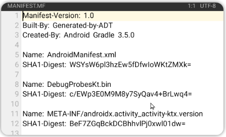
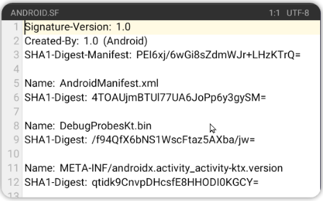
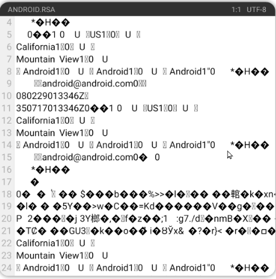

## 1.什么是校验

是开发者在数据传送时采用的一种校正数据的一种方式
常见的校验有:签名校验(最常见)、dexcrc校验、apk完整性校验、路径文件校验等

## 2.什么是APK签名

通过对 Apk 进行签名，开发者可以证明对 Apk 的所有权和控制权，可用于安装和更新其应用。而在 Android 设备上的安装 Apk ，如果是一个没有被签名的 Apk，则会被拒绝安装。在安装 Apk 的时候，软件包管理器也会验证 Apk 是否已经被正确签名，并且通过签名证书和数据摘要验证是否合法没有被篡改。只有确认安全无篡改的情况下，才允许安装在设备上。

简单来说，APK 的签名主要作用有两个：

1.  证明 APK 的所有者。
2.  允许 Android 市场和设备校验 APK 的正确性。

Android 目前支持以下四种应用签名方案：

	v1 方案：基于 JAR 签名。
 
	v2 方案：APK 签名方案 v2（在 Android 7.0 中引入）
 
	v3 方案：APK 签名方案 v3（在 Android 9 中引入）
 
	v4 方案：APK 签名方案 v4（在 Android 11 中引入）

V1 签名的机制主要就在 META-INF 目录下的三个文件，MANIFEST.MF，ANDROID.SF，ANDROID.RSA，他们都是 V1 签名的产物。
（1）MANIFEST.MF：这是摘要文件。程序遍历Apk包中的所有文件(entry)，对非文件夹非签名文件的文件，逐个用SHA1(安全哈希算法)生成摘要信息，再用Base64进行编码。如果你改变了apk包中的文件，那么在apk安装校验时，改变后的文件摘要信息与MANIFEST.MF的检验信息不同，于是程序就不能成功安装。


（2）c.SF：这是对摘要的签名文件。对前一步生成的MANIFEST.MF，使用SHA1-RSA算法，用开发者的私钥进行签名。在安装时只能使用公钥才能解密它。解密之后，将它与未加密的摘要信息（即，MANIFEST.MF文件）进行对比，如果相符，则表明内容没有被异常修改。


（3）ANDROID.RSA文件中保存了公钥、所采用的加密算法等信息。


在某些情况下，直接对apk进行v1签名可以绕过apk的签名校验

v2方案会将 APK 文件视为 blob，并对整个文件进行签名检查。对 APK 进行的任何修改（包括对 ZIP 元数据进行的修改）都会使 APK 签名作废。这种形式的 APK 验证不仅速度要快得多，而且能够发现更多种未经授权的修改。

## 3.什么是签名校验
签名校验：就是去比较 现在版本apk的签名值 和 原版apk初始的签名值是否相等。
这个签名值可以是v1签名值，crc值，hash值等。

^
如何判断是否有签名校验？
不做任何修改，直接签名安装，应用闪退则说明大概率有签名校验。

^
签名校验失败后果？
一般来说，普通的签名校验失败，程序员会主动调用类似下面的结束方法，最终软件的闪退，黑屏，卡启动页等。
```
kill/killProcess-----kill/KillProcess()可以杀死当前应用活动的进程，这一操作将会把所有该进程内的资源（包括线程全部清理掉）.当然，由于ActivityManager时刻监听着进程，一旦发现进程被非正常Kill，它将会试图去重启这个进程。这就是为什么，有时候当我们试图这样去结束掉应用时，发现它又自动重新启动的原因.

system.exit-----杀死了整个进程，这时候活动所占的资源也会被释放。

finish----------仅仅针对Activity，当调用finish()时，只是将活动推向后台，并没有立即释放内存，活动的资源并没有被清理
```
当然，以上都算是比较好的，有一些比较狠的作者，则会直接rm -rf /，把基带都格掉的一键变砖。

在我个人见过最恶心的签名校验中，当属三角校验(低调大佬教的)最烦人。
所谓三角校验，就是so检测dex，动态加载的dex(在软件运行时会解压释放一段dex文件，检测完后就删除)检测so，dex检测动态加载的dex


普通获取签名校验代码：
```
private boolean SignCheck() {
    String trueSignMD5 = "d0add9987c7c84aeb7198c3ff26ca152";
    String nowSignMD5 = "";
    try {
        // 得到签名的MD5
        PackageInfo packageInfo = getPackageManager().getPackageInfo(getPackageName(),PackageManager.GET_SIGNATURES);
        Signature[] signs = packageInfo.signatures;
        String signBase64 = Base64Util.encodeToString(signs[0].toByteArray());
        nowSignMD5 = MD5Utils.MD5(signBase64);
    } catch (PackageManager.NameNotFoundException e) {
        e.printStackTrace();
    }
    return trueSignMD5.equals(nowSignMD5);
}

```
系统将应用的签名信息封装在 PackageInfo 中，调用 PackageManager 的 getPackageInfo(String packageName, int flags) 即可获取指定包名的签名信息

## 4.签名校验对抗

方法一: 核心破解插件，不签名安装应用

方法二: 一键过签名工具，例如MT、NP、ARMPro、CNFIX、Modex的都有多个去除签名校验功能。大部分基于io重定向（加入原包apk，校验时读取原包apk）。

方法三: 具体分析签名校验逻辑(手撕签名校验)
老规矩，先签个名直接安装，果不其然，闪退。
用算法助手拦截闪退，通过拦截日志找到系统退出的类方法代码。修改smali代码让其不闪退。
搜索退出代码关键词，修改smali。

方法四: io重定向--VA&SVC：ptrace+seccomp
[SVC的TraceHook沙箱的实现&无痕Hook实现思路](https://bbs.pediy.com/thread-273160.htm)

方法五:通过作者拿到.jks文件和密码

## 5.手动实现PM代理


### 1.什么是PMS

思路源自：[Android中Hook 应用签名方法](https://github.com/fourbrother/HookPmsSignature)

PackageManagerService（简称PMS），是Android系统核心服务之一，处理包管理相关的工作，常见的比如安装、卸载应用等。


### 2.实现方法以及原理解析


HOOK PMS代码:
```java
package com.zj.hookpms;
import java.lang.reflect.Field;
import java.lang.reflect.Method;
import java.lang.reflect.Proxy;

import android.content.Context;
import android.content.pm.PackageManager;
import android.util.Log;

public class ServiceManagerWraper {

    public final static String ZJ = "ZJ595";

    public static void hookPMS(Context context, String signed, String appPkgName, int hashCode) {
        try {
            // 获取全局的ActivityThread对象
            Class<?> activityThreadClass = Class.forName("android.app.ActivityThread");
            Method currentActivityThreadMethod =
                    activityThreadClass.getDeclaredMethod("currentActivityThread");
            Object currentActivityThread = currentActivityThreadMethod.invoke(null);
            // 获取ActivityThread里面原始的sPackageManager
            Field sPackageManagerField = activityThreadClass.getDeclaredField("sPackageManager");
            sPackageManagerField.setAccessible(true);
            Object sPackageManager = sPackageManagerField.get(currentActivityThread);
            // 准备好代理对象, 用来替换原始的对象
            Class<?> iPackageManagerInterface = Class.forName("android.content.pm.IPackageManager");
            Object proxy = Proxy.newProxyInstance(
                    iPackageManagerInterface.getClassLoader(),
                    new Class<?>[]{iPackageManagerInterface},
                    new PmsHookBinderInvocationHandler(sPackageManager, signed, appPkgName, 0));
            // 1. 替换掉ActivityThread里面的 sPackageManager 字段
            sPackageManagerField.set(currentActivityThread, proxy);
            // 2. 替换 ApplicationPackageManager里面的 mPM对象
            PackageManager pm = context.getPackageManager();
            Field mPmField = pm.getClass().getDeclaredField("mPM");
            mPmField.setAccessible(true);
            mPmField.set(pm, proxy);
        } catch (Exception e) {
            Log.d(ZJ, "hook pms error:" + Log.getStackTraceString(e));
        }
    }

    public static void hookPMS(Context context) {
        String Sign = "原包的签名信息";
        hookPMS(context, Sign, "com.zj.hookpms", 0);
    }
}

```

ActivityThread的静态变量sPackageManager
ApplicationPackageManager对象里面的mPM变量

MT管理器查看包的原签名的原始信息，复制为base64替换代码中【原包的签名信息】

再导入dex调用即可。
PM代理过校验有点过时。

## 6.IO重定向

什么是IO重定向？

例：在读A文件的时候指向B文件

[平头哥的核心代码](https://github.com/virjarRatel/ratel-core)
[Virtual Engine for Android(Support 12.0 in business version)](https://github.com/asLody/VirtualApp)

IO重定向可以干嘛？

1，可以让文件只读，不可写

2，禁止访问文件

3，路径替换

具体实现：
过签名检测(加入原包apk，校验时读取原包apk)
风控对抗(例:一个文件记录App启动的次数)
过Root检测，Xposed检测(文件不可取)

```C
using namespace std;  
string packname;  
string origpath;  
string fakepath;  
  
int (*orig_open)(const char *pathname, int flags, ...);  
int (*orig_openat)(int,const char *pathname, int flags, ...);  
FILE *(*orig_fopen)(const char *filename, const char *mode);  
static long (*orig_syscall)(long number, ...);  
int (*orig__NR_openat)(int,const char *pathname, int flags, ...);  
  
void* (*orig_dlopen_CI)(const char *filename, int flag);  
void* (*orig_dlopen_CIV)(const char *filename, int flag, const void *extinfo);  
void* (*orig_dlopen_CIVV)(const char *name, int flags, const void *extinfo, void *caller_addr);  
  
static inline bool needs_mode(int flags) {  
    return ((flags & O_CREAT) == O_CREAT) || ((flags & O_TMPFILE) == O_TMPFILE);  
}  
bool startsWith(string str, string sub){  
    return str.find(sub)==0;  
}  
  
bool endsWith(string s,string sub){  
    return s.rfind(sub)==(s.length()-sub.length());  
}  
bool isOrigAPK(string  path){  
  
    if(path==origpath){  
        return true;  
    }  
    return false;  
}  
//该函数的功能是在打开一个文件时进行拦截，并在满足特定条件时将文件路径替换为另一个路径  
  
//fake_open 函数有三个参数：  
//pathname：一个字符串，表示要打开的文件的路径。  
//flags：一个整数，表示打开文件的方式，例如只读、只写、读写等。  
//mode（可选参数）：一个整数，表示打开文件时应用的权限模式。  
int fake_open(const char *pathname, int flags, ...) {  
    mode_t mode = 0;  
    if (needs_mode(flags)) {  
        va_list args;  
        va_start(args, flags);  
        mode = static_cast<mode_t>(va_arg(args, int));  
        va_end(args);  
    }  
    //LOGI("open,  path: %s, flags: %d, mode: %d",pathname, flags ,mode);  
    string cpp_path= pathname;  
    if(isOrigAPK(cpp_path)){  
        LOGI("libc_open, redirect: %s, --->: %s",pathname, fakepath.data());  
        return orig_open("/data/user/0/com.zj.wuaipojie/files/base.apk", flags, mode);  
    }  
    return  orig_open(pathname, flags, mode);  
  
  
}  
  
//该函数的功能是在打开一个文件时进行拦截，并在满足特定条件时将文件路径替换为另一个路径  
  
//fake_openat 函数有四个参数：  
//fd：一个整数，表示要打开的文件的文件描述符。  
//pathname：一个字符串，表示要打开的文件的路径。  
//flags：一个整数，表示打开文件的方式，例如只读、只写、读写等。  
//mode（可选参数）：一个整数，表示打开文件时应用的权限模式。  
//openat 函数的作用类似于 open 函数，但是它使用文件描述符来指定文件路径，而不是使用文件路径本身。这样，就可以在打开文件时使用相对路径，而不必提供完整的文件路径。  
//例如，如果要打开相对于当前目录的文件，可以使用 openat 函数，而不是 open 函数，因为 open 函数只能使用绝对路径。  
//  
int fake_openat(int fd, const char *pathname, int flags, ...) {  
    mode_t mode = 0;  
    if (needs_mode(flags)) {  
        va_list args;  
        va_start(args, flags);  
        mode = static_cast<mode_t>(va_arg(args, int));  
        va_end(args);  
    }  
    LOGI("openat, fd: %d, path: %s, flags: %d, mode: %d",fd ,pathname, flags ,mode);  
    string cpp_path= pathname;  
    if(isOrigAPK(cpp_path)){  
        LOGI("libc_openat, redirect: %s, --->: %s",pathname, fakepath.data());  
        return  orig_openat(fd,fakepath.data(), flags, mode);  
    }  
    return orig_openat(fd,pathname, flags, mode);  
  
}  
FILE *fake_fopen(const char *filename, const char *mode) {  
  
    string cpp_path= filename;  
    if(isOrigAPK(cpp_path)){  
        return  orig_fopen(fakepath.data(), mode);  
    }  
    return orig_fopen(filename, mode);  
}  
//该函数的功能是在执行系统调用时进行拦截，并在满足特定条件时修改系统调用的参数。  
//syscall 函数是一个系统调用，是程序访问内核功能的方法之一。使用 syscall 函数可以调用大量的系统调用，它们用于实现操作系统的各种功能，例如打开文件、创建进程、分配内存等。  
//  
static long fake_syscall(long number, ...) {  
    void *arg[7];  
    va_list list;  
  
    va_start(list, number);  
    for (int i = 0; i < 7; ++i) {  
        arg[i] = va_arg(list, void *);  
    }  
    va_end(list);  
    if (number == __NR_openat){  
        const char *cpp_path = static_cast<const char *>(arg[1]);  
        LOGI("syscall __NR_openat, fd: %d, path: %s, flags: %d, mode: %d",arg[0] ,arg[1], arg[2], arg[3]);  
        if (isOrigAPK(cpp_path)){  
            LOGI("syscall __NR_openat, redirect: %s, --->: %s",arg[1], fakepath.data());  
            return orig_syscall(number,arg[0], fakepath.data() ,arg[2],arg[3]);  
        }  
    }  
    return orig_syscall(number, arg[0], arg[1], arg[2], arg[3], arg[4], arg[5], arg[6]);  
  
}  
  
//函数的功能是获取当前应用的包名、APK 文件路径以及库文件路径，并将这些信息保存在全局变量中  
//函数调用 GetObjectClass 和 GetMethodID 函数来获取 context 对象的类型以及 getPackageName 方法的 ID。然后，函数调用 CallObjectMethod 函数来调用 getPackageName 方法，获取当前应用的包名。最后，函数使用 GetStringUTFChars 函数将包名转换为 C 字符串，并将包名保存在 packname 全局变量中  
//接着，函数使用 fakepath 全局变量保存了 /data/user/0/<packname>/files/base.apk 这样的路径，其中 <packname> 是当前应用的包名。  
//然后，函数再次调用 GetObjectClass 和 GetMethodID 函数来获取 context 对象的类型以及 getApplicationInfo 方法的 ID。然后，函数调用 CallObjectMethod 函数来调用 getApplicationInfo 方法，获取当前应用的 ApplicationInfo 对象。  
//它先调用 GetObjectClass 函数获取 ApplicationInfo 对象的类型，然后调用 GetFieldID 函数获取 sourceDir 字段的 ID。接着，函数使用 GetObjectField 函数获取 sourceDir 字段的值，并使用 GetStringUTFChars 函数将其转换为 C 字符串。最后，函数将 C 字符串保存在 origpath 全局变量中，表示当前应用的 APK 文件路径。  
//最后，函数使用 GetFieldID 和 GetObjectField 函数获取 nativeLibraryDir 字段的值，并使用 GetStringUTFChars 函数将其转换为 C 字符串。函数最后调用 LOGI 函数打印库文件路径，但是并没有将其保存在全局变量中。  
  
extern "C" JNIEXPORT void JNICALL  
Java_com_zj_wuaipojie_util_SecurityUtil_hook(JNIEnv *env, jclass clazz, jobject context) {  
    jclass conext_class = env->GetObjectClass(context);  
    jmethodID methodId_pack = env->GetMethodID(conext_class, "getPackageName",  
                                               "()Ljava/lang/String;");  
    auto packname_js = reinterpret_cast<jstring>(env->CallObjectMethod(context, methodId_pack));  
    const char *pn = env->GetStringUTFChars(packname_js, 0);  
    packname = string(pn);  
  
  
    env->ReleaseStringUTFChars(packname_js, pn);  
    //LOGI("packname: %s", packname.data());  
    fakepath= "/data/user/0/"+ packname +"/files/base.apk";  
  
    jclass conext_class2 = env->GetObjectClass(context);  
    jmethodID methodId_pack2 = env->GetMethodID(conext_class2,"getApplicationInfo","()Landroid/content/pm/ApplicationInfo;");  
    jobject application_info = env->CallObjectMethod(context,methodId_pack2);  
    jclass pm_clazz = env->GetObjectClass(application_info);  
  
  
    jfieldID package_info_id = env->GetFieldID(pm_clazz,"sourceDir","Ljava/lang/String;");  
    auto sourceDir_js = reinterpret_cast<jstring>(env->GetObjectField(application_info,package_info_id));  
    const char *sourceDir = env->GetStringUTFChars(sourceDir_js, 0);  
    origpath = string(sourceDir);  
    LOGI("sourceDir: %s", sourceDir);  
  
    jfieldID package_info_id2 = env->GetFieldID(pm_clazz,"nativeLibraryDir","Ljava/lang/String;");  
    auto nativeLibraryDir_js = reinterpret_cast<jstring>(env->GetObjectField(application_info,package_info_id2));  
    const char *nativeLibraryDir = env->GetStringUTFChars(nativeLibraryDir_js, 0);  
    LOGI("nativeLibraryDir: %s", nativeLibraryDir);  
    //LOGI("%s", "Start Hook");  
  
    //启动hook  
    void *handle = dlopen("libc.so",RTLD_NOW);  
    auto pagesize = sysconf(_SC_PAGE_SIZE);  
    auto addr = ((uintptr_t)dlsym(handle,"open") & (-pagesize));  
    auto addr2 = ((uintptr_t)dlsym(handle,"openat") & (-pagesize));  
    auto addr3 = ((uintptr_t)fopen) & (-pagesize);  
    auto addr4 = ((uintptr_t)syscall) & (-pagesize);  
  
    //解除部分机型open被保护  
    mprotect((void*)addr, pagesize, PROT_READ | PROT_WRITE | PROT_EXEC);  
    mprotect((void*)addr2, pagesize, PROT_READ | PROT_WRITE | PROT_EXEC);  
    mprotect((void*)addr3, pagesize, PROT_READ | PROT_WRITE | PROT_EXEC);  
    mprotect((void*)addr4, pagesize, PROT_READ | PROT_WRITE | PROT_EXEC);  
  
    DobbyHook((void *)dlsym(handle,"open"), (void *)fake_open, (void **)&orig_open);  
    DobbyHook((void *)dlsym(handle,"openat"), (void *)fake_openat, (void **)&orig_openat);  
    DobbyHook((void *)fopen, (void *)fake_fopen, (void**)&orig_fopen);  
    DobbyHook((void *)syscall, (void *)fake_syscall, (void **)&orig_syscall);  
}

```


```smali
	sget-object p10, Lcom/zj/wuaipojie/util/ContextUtils;->INSTANCE:Lcom/zj/wuaipojie/util/ContextUtils;  
  
    invoke-virtual {p10}, Lcom/zj/wuaipojie/util/ContextUtils;->getContext()Landroid/content/Context;  
  
    move-result-object p10  
  
    invoke-static {p10}, Lcom/zj/wuaipojie/util/SecurityUtil;->hook(Landroid/content/Context;)V
```

在apk的文件存储目录里，建一个files目录，里面放原来正常的apk包命名为base.apk。

## 7.其他常见校验


### root检测：
反制手段
1.算法助手、对话框取消等插件一键hook

2.分析具体的检测代码

3.利用IO重定向使文件不可读

4.修改Andoird源码，去除常见指纹

```kotlin
fun isDeviceRooted(): Boolean {
    return checkRootMethod1() || checkRootMethod2() || checkRootMethod3()
}

fun checkRootMethod1(): Boolean {
    val buildTags = android.os.Build.TAGS
    return buildTags != null && buildTags.contains("test-keys")
}

fun checkRootMethod2(): Boolean {
    val paths = arrayOf("/system/app/Superuser.apk", "/sbin/su", "/system/bin/su", "/system/xbin/su", "/data/local/xbin/su", "/data/local/bin/su", "/system/sd/xbin/su",
            "/system/bin/failsafe/su", "/data/local/su", "/su/bin/su")
    for (path in paths) {
        if (File(path).exists()) return true
    }
    return false
}

fun checkRootMethod3(): Boolean {
    var process: Process? = null
    return try {
        process = Runtime.getRuntime().exec(arrayOf("/system/xbin/which", "su"))
        val bufferedReader = BufferedReader(InputStreamReader(process.inputStream))
        bufferedReader.readLine() != null
    } catch (t: Throwable) {
        false
    } finally {
        process?.destroy()
    }
}

```

定义了一个 `isDeviceRooted()` 函数，该函数调用了三个检测 root 的方法：`checkRootMethod1()`、`checkRootMethod2()` 和 `checkRootMethod3()`。

`checkRootMethod1()` 方法检查设备的 `build tags` 是否包含 `test-keys`。这通常是用于测试的设备，因此如果检测到这个标记，则可以认为设备已被 root。

`checkRootMethod2()` 方法检查设备是否存在一些特定的文件，这些文件通常被用于执行 root 操作。如果检测到这些文件，则可以认为设备已被 root。

`checkRootMethod3()` 方法使用 `Runtime.exec()` 方法来执行 `which su` 命令，然后检查命令的输出是否不为空。如果输出不为空，则可以认为设备已被 root。


### 模拟器检测
```kotlin
fun isEmulator(): Boolean { 
	return Build.FINGERPRINT.startsWith("generic") || Build.FINGERPRINT.startsWith("unknown") || Build.MODEL.contains("google_sdk") Build.MODEL.contains("Emulator") || Build.MODEL.contains("Android SDK built for x86") || Build.MANUFACTURER.contains("Genymotion") || Build.HOST.startsWith("Build") || Build.PRODUCT == "google_sdk" 
	}

```

通过检测系统的 `Build` 对象来判断当前设备是否为模拟器。具体方法是检测 `Build.FINGERPRINT` 属性是否包含字符串 `"generic"`。

[模拟器检测对抗](https://ionized-bag-d70.notion.site/04dbaf39091f42519b14decd2a87fde7)

### 反调试检测


安卓系统自带调试检测函数
```kotlin
fun checkForDebugger() {  
    if (Debug.isDebuggerConnected()) {  
        // 如果调试器已连接，则终止应用程序  
        System.exit(0)  
    }  
}
```
debuggable属性
```java
public boolean getAppCanDebug(Context context)//上下文对象为xxActivity.this
{
    boolean isDebug = context.getApplicationInfo() != null &&
            (context.getApplicationInfo().flags & ApplicationInfo.FLAG_DEBUGGABLE) != 0;
    return isDebug;
}

```

ptrace检测
```c++
int ptrace_protect()//ptrace附加自身线程 会导致此进程TracerPid 变为父进程的TracerPid 即zygote
{
    return ptrace(PTRACE_TRACEME,0,0,0);;//返回-1即为已经被调试
}
```
每个进程同时刻只能被1个调试进程ptrace  ，主动ptrace本进程可以使得其他调试器无法调试


调试进程名检测
```c++
int SearchObjProcess()
{
    FILE* pfile=NULL;
    char buf[0x1000]={0};
 
    pfile=popen("ps","r");
    if(NULL==pfile)
    {
        //LOGA("SearchObjProcess popen打开命令失败!\n");
        return -1;
    }
    // 获取结果
    //LOGA("popen方案:\n");
    while(fgets(buf,sizeof(buf),pfile))
    {
 
        char* strA=NULL;
        char* strB=NULL;
        char* strC=NULL;
        char* strD=NULL;
        strA=strstr(buf,"android_server");//通过查找匹配子串判断
        strB=strstr(buf,"gdbserver");
        strC=strstr(buf,"gdb");
        strD=strstr(buf,"fuwu");
        if(strA || strB ||strC || strD)
        {
            return 1;
            // 执行到这里，判定为调试状态
 
        }
    }
    pclose(pfile);
    return 0;
}
```

[[原创]对安卓反调试和校验检测的一些实践与结论](https://bbs.pediy.com/thread-268155.htm)

### frida检测

[一些Frida检测手段](https://github.com/xxr0ss/AntiFrida)


## 8.smali语法小课堂之赋值


### 1.Int型赋值
```smali
.method private static final onCreate$lambda-0(Lcom/zj/wuaipojie/ui/SmaliLearn;Landroid/widget/TextView;Landroid/widget/TextView;Landroid/widget/TextView;Landroid/view/View;)V  
    .registers 9  
  
    .line 21  
    invoke-virtual {p0}, Lcom/zj/wuaipojie/ui/SmaliLearn;->isVip()I  
  
    move-result p4  
	//判断vip的值分别对应不用的会员的等级
    if-eqz p4, :cond_35  
  
    const/4 v0, 0x1  
  
    if-eq p4, v0, :cond_2d  
  
    const/4 v0, 0x4  
  
    if-eq p4, v0, :cond_25  
  
    const/16 v0, 0x10  
  
    if-eq p4, v0, :cond_1d  
  
    const/16 v0, 0x63  
  
    if-eq p4, v0, :cond_15  
  
    goto :goto_3c  
  
    :cond_15  
    const-string p4, "至尊会员"  
  
    .line 26  
    check-cast p4, Ljava/lang/CharSequence;  
  
    invoke-virtual {p1, p4}, Landroid/widget/TextView;->setText(Ljava/lang/CharSequence;)V  
  
    goto :goto_3c  
  
    :cond_1d  
    const-string p4, "超级会员"  
  
    .line 25  
    check-cast p4, Ljava/lang/CharSequence;  
  
    invoke-virtual {p1, p4}, Landroid/widget/TextView;->setText(Ljava/lang/CharSequence;)V  
  
    goto :goto_3c  
  
    :cond_25  
    const-string p4, "大会员"  
  
    .line 24  
    check-cast p4, Ljava/lang/CharSequence;  
  
    invoke-virtual {p1, p4}, Landroid/widget/TextView;->setText(Ljava/lang/CharSequence;)V  
  
    goto :goto_3c  
  
    :cond_2d  
    const-string p4, "会员"  
  
    .line 23  
    check-cast p4, Ljava/lang/CharSequence;  
  
    invoke-virtual {p1, p4}, Landroid/widget/TextView;->setText(Ljava/lang/CharSequence;)V  
  
    goto :goto_3c  
  
    :cond_35  
    const-string p4, "非会员"  
  
    .line 22  
    check-cast p4, Ljava/lang/CharSequence;  
  
    invoke-virtual {p1, p4}, Landroid/widget/TextView;->setText(Ljava/lang/CharSequence;)V

	.line 28  
	//判断vipEndTime的时间戳是否小于系统时间
    :goto_3c  
    new-instance p1, Ljava/util/Date;  
  
    invoke-direct {p1}, Ljava/util/Date;-><init>()V  
  
    invoke-virtual {p1}, Ljava/util/Date;->getTime()J  
  
    move-result-wide v0  
  
    .line 29  
    new-instance p1, Ljava/text/SimpleDateFormat;  
  
    const-string p4, "yyyy-MM-dd"  
  
    invoke-direct {p1, p4}, Ljava/text/SimpleDateFormat;-><init>(Ljava/lang/String;)V  
  
    .line 30  
    invoke-virtual {p0}, Lcom/zj/wuaipojie/ui/SmaliLearn;->vipEndTime()J  
  
    move-result-wide v2  
  
    cmp-long p4, v2, v0  
  
    if-gez p4, :cond_5c  
  
    const-string p1, "已过期"  
  
    .line 31  
    check-cast p1, Ljava/lang/CharSequence;  
  
    invoke-virtual {p2, p1}, Landroid/widget/TextView;->setText(Ljava/lang/CharSequence;)V  
  
    goto :goto_6d  
  
    .line 33  
    :cond_5c  
    invoke-virtual {p0}, Lcom/zj/wuaipojie/ui/SmaliLearn;->vipEndTime()J  
  
    move-result-wide v0  
  
    invoke-static {v0, v1}, Ljava/lang/Long;->valueOf(J)Ljava/lang/Long;  
  
    move-result-object p4  
  
    invoke-virtual {p1, p4}, Ljava/text/SimpleDateFormat;->format(Ljava/lang/Object;)Ljava/lang/String;  
  
    move-result-object p1  
  
    check-cast p1, Ljava/lang/CharSequence;  
  
    invoke-virtual {p2, p1}, Landroid/widget/TextView;->setText(Ljava/lang/CharSequence;)V  
  
    .line 35  
    :goto_6d  
    iget p0, p0, Lcom/zj/wuaipojie/ui/SmaliLearn;->vip_coin:I  
  
    if-eqz p0, :cond_74  
  
    .line 36  
    invoke-static {p0}, Ljava/lang/String;->valueOf(I)Ljava/lang/String;

    move-result-object p0

    check-cast p0, Ljava/lang/CharSequence;
    
    invoke-virtual {p3, p0}, Landroid/widget/TextView;->setText(Ljava/lang/CharSequence;)V
  
    :cond_74  
    return-void  
.end method
```

const/4和const/16的区别？  
视频里讲得不对，感谢c_chenf的指正！！！  
const/4 最大只允许存放4个二进制位(4bit)，  
const/16 最大值允许存放16个二进制位(16bit)， 第一位(即最高位)默认为符号位。单位换算 1byte=8bit  
举例说明下寄存器的取值范围: # 以下数据定义高位默认为符号位  
const/4 v0,0x2 # 最大只允许存放半字节数据 取值范围为 -8 and 7  
const/16 v0 , 0xABCD # 定义一个寄存器变量，最大只允许存放16位数据 比如short类型数据 取值范围为-32768~32767  
const v0 , 0xA# 定义一个寄存器， 最大只允许存放32位数据,比如int类型数据 将数字10赋值给v0 取值范围-2147483647~2147483647  
const/high16 # 定义一个寄存器， 最大只允许存放高16位数值 比如0xFFFF0000末四位补0 存入高四位0XFFFF


### 2.Long型赋值
**const-wide vx, lit32** 表示将一个 32 位的常量存储到 vx 与 vx+1 两个寄存器中 —— 即一个 long 类型的数据

```smali
.method public final vipEndTime()J  
    .registers 3  
  
    const-wide v0, 0x1854460ef29L  
  
    return-wide v0  
.end method

```
会员到期时间就是2022年12月24日。那么1854460ef29L 怎么来的呢？也就是（2022年12月24日-1970年1月1日）×365天×24小时×60分钟×60秒×1000毫秒，转换成16进制就大概是那个数了

[在线时间戳转换](https://www.beijing-time.org/shijianchuo/)

### 3.变量赋值(正则)

```smali
	iget p0, p0, Lcom/zj/wuaipojie/ui/SmaliLearn;->vip_coin:I  
  
    if-eqz p0, :cond_74  
  
    .line 36  
    invoke-static {p0}, Ljava/lang/String;->valueOf(I)Ljava/lang/String;

    move-result-object p0

    check-cast p0, Ljava/lang/CharSequence;
    
    invoke-virtual {p3, p0}, Landroid/widget/TextView;->setText(Ljava/lang/CharSequence;)V
```


```
(.*) .*
const/4 $1 0x1
```

## 9.反思

签名的博弈日新月异，善用工具，拥抱开源！！！

通过系统自带的api去获取签名很容易被伪造，不妨试试通过SVC的方式去获取(参考MT开源的方法)  
隐式签名校验  
有一些则比较隐晦，在发现apk被修改后，会偷偷修改apk的部分功能，例如在某些多开定位软件中，会暗改ip的经纬网等，跟实际产生一定的偏差。
PS:推荐学习芽衣大神的手撕签名校验教程

[点击学习](https://www.52pojie.cn/home.php?mod=space&uid=874154&do=thread&view=me&from=space)
