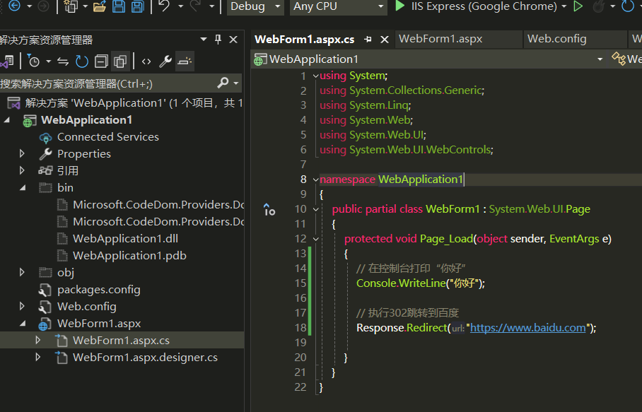
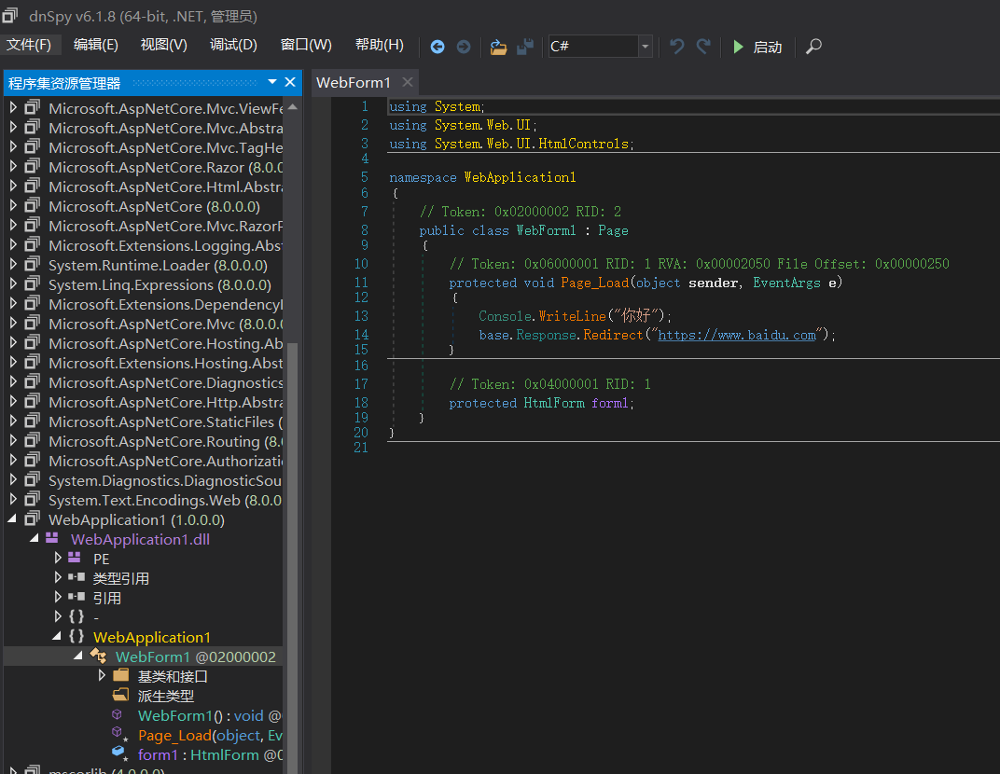

在.NET程序中，最容易出现问题的就是权限问题，文件上传apsx，sql注入。


### **基础知识：**

ASP.NET开发可以选用两种框架：`ASP.NET Core`与`ASP.NET Framework`

ASP.NET开发也分为两种：
1、WebApplication：
```
WEB应用程序，改变代码后需要重启网页。具有namespace空间名称，项目中所有的程序代码文件，和独立的文件都被编译成为一个程序集，保存在bin文件夹中。
```
2、WebSite：
```
WEB网站，改变代码后不用重启网页。它没用到namespace空间名称，每个asp页面会转成一个dll。
.NET Framework 用asp,aspx居多
.NET Core 用cshtml居多
```

^
## **ASP.NET Framework比较关键的文件：**
> web.config:

```
1.web.config是基于XML的文件，可以保存到Web应用程序中的任何目录中，
用来储存数据库连接字符、身份安全验证等。
2.加载方式：当前目录搜索 -> 上一级到根目录 ->
 %windir%/Microsoft.NET/Framework/v2.0.50727/CONFIG/web.config ->
 %windir%/Microsoft.NET/Framework/v2.0.50727/CONFIG/machine.config -> 都不存在返回null
```

> Global.asax：

```
1. Global.asax提供全局可用的代码，从HttpApplication基类派生的类，响应的是应用程序级别会话级别事件，通常ASP.NET的全局过滤代码就是在这里面。
```

^
## **ASP.NET的常见拓展名：**

在`%windir%\Microsoft.NET\Framework\v2.0.50727\CONFIG\web.config`中有详细定义，这里提取部分简单介绍。


```
aspx：应用程序根目录或子目录，包含web控件与其他
cs：类文件
aspx.cs：web窗体后台程序代码文件 
aspx页面编写前端代码，.aspx.cs页面编写后端代码，后端编译后在bin目录的dll中

ascx：应用程序根目录或子目录,Web 用户控件文件。
asmx：应用程序根目录或子目录，该文件包含通过 SOAP 方式可用于其他 Web 应用程序的类和方法。
asax：应用程序根目录，通常是Global.asax
config：应用程序根目录或子目录，通常是web.config
ashx：应用程序根目录或子目录,该文件包含实现 IHttpHandler 接口以处理所有传入请求的代码。
soap：应用程序根目录或子目录。soap拓展文件
```


^
## **代码审计**
<https://www.geekby.site/2024/08/dotnet%E4%BB%A3%E7%A0%81%E5%AE%A1%E8%AE%A1%E7%B3%BB%E5%88%97%E4%B8%80/>


^
## **代码审计实战思路**
#### **1、熟悉框架目录配置**
```
├─Admin
├─App_Data  //App_Data文件夹应该包含应用程序的本地数据存储
├─bin     // 包含应用程序所需的任何预生成的程序集
├─bootstrap
├─css
├─images
├─img
├─install
├─javascript
├─m
├─purchase
├─style
├─temp
├─Template
├─uploads
└─UserControl
```
WEB应用程序会把我们写的代码编译为DLL文件存放在Bin文件夹中，在ASPX文中基本就是一些控件名，所以需要反编译他的DLL来进行审计。

发布后目录参考
```
-bin
-Web.config
-WebForm1.aspx
```


#### **2、一个Logout.aspx示例**
```
<%@ Page Language="C#" AutoEventWireup="true" CodeBehind="Logout.aspx.cs" Inherits="Book.Logout" %>
<html xmlns="http://www.w3.org/1999/xhtml" >
...
</html>

在文件头中有这几个参数：
1.Language="C#" //脚本语言
2.AutoEventWireup="true" //是否自动关联某些特殊事件
3.CodeBehind="Logout.aspx.cs" //指定包含与页关联的类的已编译文件的名称
4.Inherits="Book.Logout" //定义供页继承的代码隐藏类

我们所关注的也就是Inherits 的值，如上所示他指向了Bin目录下的purchase.dll中Book类的Logout函数
（注：purchase.dll是网站编译的项目名，一般与文件目录对应）
```
类后端

反编译bin/dll


#### **3、一个web.config示例**
这个文件包含了目录权限控制、数据库密码等等
```
<location path="purchase/orderdetail.aspx">
    <system.web>
      <authorization>
        <allow users="*"/>
      </authorization>
    </system.web>
  </location>

  <authentication mode="Forms" />
```
比如我们使用的这套程序中定义了`purchase/orderdetail.aspx`匿名可以访问。
```
在web.config中有四种验证模式：

方式	描述
window	IIS验证，在内联网环境中非常有用
Passport	微软集中式身份验证，一次登录便可访问所有成员站点，需要收费
Form	窗体验证，验证帐号/密码，Web编程最佳最流行的验证方式
None	表示ASP.NET自己根本不执行身份验证，完全依赖IIS身份验证
```


^
## **代码审计点**
文件上传aspx
```
saveas()
File.Move(sourcePath, destinationPath);
File.Copy(sourcePath, destinationPath);
System.IO.File.WriteAllBytes
```
RCE
```
cmd
Process.Start()
ShellExecute()
```