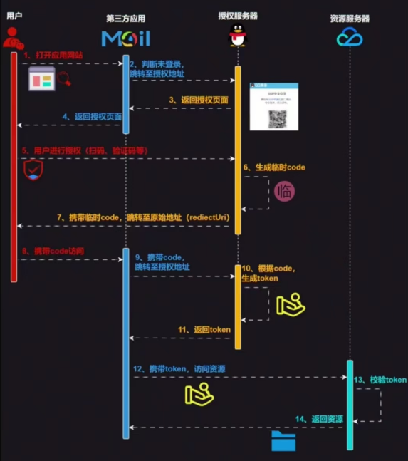

OAuth 提供了一种安全的方式来授权第三方应用访问用户资源，而无需暴露用户的用户名和密码。
OAuth是一个开放的授权标准，它允许用户授权第三方应用访问他们存储在另外服务上的信息，而无需将用户名和密码提供给第三方应用。OAuth 的核心思想是允许用户通过一个授权令牌（token）来授予访问权限，而不是分享他们的认证凭据（如用户名和密码）。

OAuth 的工作原理大致如下：
资源所有者（User）：希望授权第三方应用访问其资源的用户。
资源服务器（Service Provider）：存储用户资源的服务器，例如用户的邮箱、照片等。
客户端（Client）：请求访问资源的第三方应用。
授权服务器（Authorization Server）：负责发放授权令牌的服务器。

OAuth 的流程通常包括以下步骤：
用户（资源所有者）选择授权第三方应用访问其在服务提供商处的资源。
用户被重定向到授权服务器，通常是通过一个包含授权请求的URL。
用户登录（如果尚未登录）并同意授权请求。
授权服务器发放一个授权码（authorization code）给用户，用户将其提供给第三方应用。
第三方应用使用授权码向授权服务器请求访问令牌。
授权服务器验证授权码后，发放一个访问令牌（access token）给第三方应用。
第三方应用使用访问令牌直接向资源服务器请求资源。

OAuth 有多个版本，其中最常用的是 OAuth 2.0，它提供了更灵活的授权流程和更好的安全性。OAuth 2.0 支持多种授权流程，如授权码流程（Authorization Code Grant）、客户端凭据流程（Client Credentials Grant）、密码凭据流程（Resource Owner Password Credentials Grant）和简化流程（Implicit Grant）等，以满足不同场景的需求。

OAuth 2.0 的一个简单解释
<https://www.ruanyifeng.com/blog/2019/04/oauth_design.html>

<https://www.ruanyifeng.com/blog/2014/05/oauth_2_0.html>

