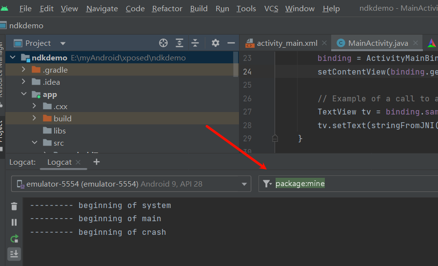

ADB（Android Debug Bridge）是一种用于在计算机和 Android 设备之间进行通信和控制的命令行工具。它是 Android SDK 的一部分，通常用于开发和调试 Android 应用程序，以及执行各种与设备相关的操作。
adb是安卓调试器，gdb是c语言调试器。

通过 ADB，开发者可以执行以下一些常见的任务：

1. **安装和卸载应用程序**：通过 ADB 可以将应用程序安装到 Android 设备上，也可以从设备上卸载应用程序。
2. **调试应用程序**：ADB 提供了在开发过程中调试应用程序的功能，可以查看日志、调试信息，并在需要时进行远程调试。
3. **文件传输**：通过 ADB 可以将文件从计算机复制到 Android 设备，或者从设备复制文件到计算机。
4. **查看设备信息**：ADB 可以提供设备的各种信息，如设备型号、Android 版本、序列号等。
5. **执行 Shell 命令**：通过 ADB 可以在设备上执行各种 Shell 命令，从而实现对设备的高级操作和配置。

总之，ADB 是 Android 开发者在开发、调试和管理 Android 设备时经常使用的一个重要工具。


## **常用的ADB命令**
```
adb devices：列出当前连接到计算机的所有 Android 设备。

adb connect 127.0.0.1:端口  连接设备。

adb shell：启动与设备的命令行交互会话。

adb root 获取root权限，模拟器中点确认授权给shell。

adb install <path_to_apk>：将应用程序安装到设备上。<path_to_apk> 是应用程序的 APK 文件路径。

adb uninstall <package_name>：从设备上卸载指定的应用程序。<package_name> 是应用程序的包名。

adb pull <remote_path> <local_path>：从设备中拉取文件到计算机。<remote_path> 是设备上文件的路径，<local_path> 是计算机上保存文件的路径。

adb push <local_path> <remote_path>：将文件推送到设备。<local_path> 是计算机上文件的路径，<remote_path> 是设备上保存文件的路径。

adb logcat：查看设备的日志输出。可以使用此命令来调试应用程序或监视设备的系统日志。

adb reboot：重新启动设备。

adb shell pm list packages：列出设备上安装的所有应用程序包名。

adb shell dumpsys：显示设备的各种系统信息。
```

```
# 进入手机系统 shell 并将权限提升为root权限
adb shell
su

# 检查 Android 架构(x86/x64)
adb shell getprop ro.product.cpu.abi
adb shell getprop | findstr abi
# 更详细的架构信息
adb shell cat /proc/cpuinfo

# 获取手机里安装过的应用程序apk绝对路径，只想获取包名把后面的-f去掉即可
adb shell pm list packages -f
# 获取应用程序的绝对路径路径
adb shell pm path com.app.test

# 获取当前打开的 app 的包名
adb shell dumpsys window | findstr mCurrentFocus

# 实时监控【com.app.test】包的运行日志
adb logcat | findstr com.app.test

# 将test.apk安装到手机
adb install ./test.apk

# 把手机里的test.apk文件拉出来到本地电脑
adb pull /data/app/test.apk

# 把电脑里里的test.apk文件上传到手机系统的 /data/local/tmp 下
adb push ./test.apk /data/local/tmp
```
as也可以过滤查看日志，等同adb logcat | findstr com.app.test
