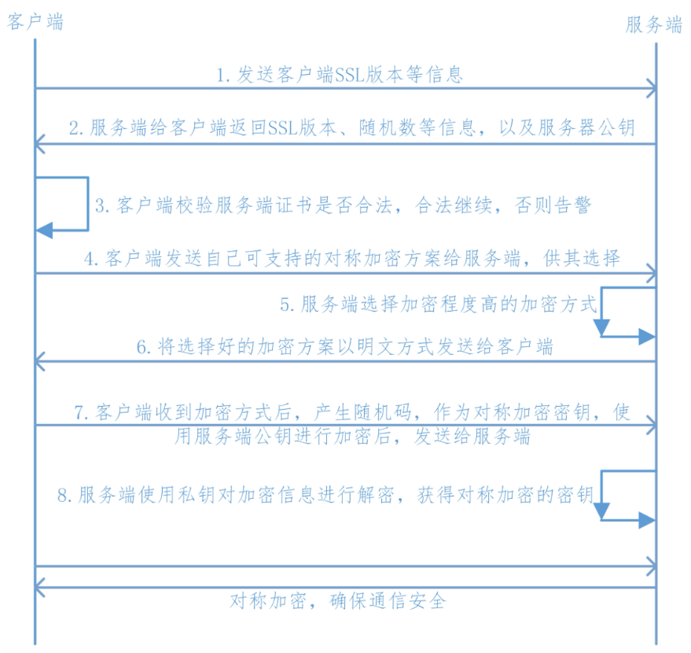

代理检测
双向认证
### 1.代理检测  
`定义`  
代理检测是用于检测设备是否设置了网络代理。这种检测的目的是识别出设备是否尝试通过代理服务器（如抓包工具）来转发网络流量，从而可能截获和分析App的网络通信。  
`原理`  
App会检查系统设置或网络配置，以确定是否有代理服务器被设置为转发流量。例如，它可能会检查系统属性或调用特定的网络信息API来获取当前的网络代理状态。  
```java  
return System.getProperty("http.proxyHost") == null && System.getProperty("http.proxyPort")  == null  
  
Port跟设置有关，例如Charles默认是8888  
```  
  
`检测到代理，强制不走代理`  
```java  
connection = (HttpURLConnection) url.openConnection(Proxy.NO_PROXY);  
  
OkHttpClient.Builder()  
    .proxy(Proxy.NO_PROXY)  
    .build()  
```  
1、`anti脚本:`  让其检测不到代理
```js  
function anti_proxy() {  
    var GetProperty = Java.use("java.lang.System");  
    GetProperty.getProperty.overload("java.lang.String").implementation = function(getprop) {  
        if (getprop.indexOf("http.proxyHost") >= 0 || getprop.indexOf("http.proxyPort") >= 0) {  
            return null;  
        }  
        return this.getProperty(getprop);  
    }  
}  
```  
2、`透明代理`  
透明代理（Transparent Proxy）是一种特殊的代理服务类型，它可以在客户端（如浏览器或应用程序）不知道的情况下拦截、转发和处理网络请求。与传统的代理服务不同，透明代理不需要客户端进行任何配置就能工作。  
[[Clash版]安卓上基于透明代理实现热点抓包](https://blog.seeflower.dev/archives/296/)  
[安卓上基于透明代理对特定APP抓包](https://blog.seeflower.dev/archives/207/)  
虚拟机不代理，宿主机代理。

3、算法助手

^
### 2.VPN检测  
`定义`  
VPN检测是指应用程序或系统检查用户是否正在使用虚拟专用网络（Virtual Private Network, VPN）的一种技术。当用户使用VPN时，他们的网络流量会被加密并通过一个远程服务器路由，这可以隐藏用户的实际IP地址和位置信息，同时保护数据的安全性和隐私。  
`原理`  
当客户端运行VPN虚拟隧道协议时，会在当前节点创建基于`eth`之上的`tun0`接口或`ppp0`接口。这些接口是用于建立虚拟网络连接的特殊网络接口。  
根据OSI七层模型，二者分别支持的协议:  
  
| VPN | OpvenVPN、IPsec、IKEv2、PPTP、L2TP、WireGuard等 |  
| --- | ----------------------------------------- |  
| 代理  | HTTP、HTTPS、SOCKS、FTP、RTSP等                |  

VPN 协议大多是作用在 OSI 的第二层和第三层之间，比代理低层，由此可见VPN能抓到代理方式的所有的包 。
  
```
public final boolean Check_Vpn1() {  
        try {  
            Enumeration<NetworkInterface> networkInterfaces = NetworkInterface.getNetworkInterfaces();  
            if (networkInterfaces == null) {  
                return false;  
            }  
            Iterator it = Collections.list(networkInterfaces).iterator();  
            while (it.hasNext()) {  
                NetworkInterface networkInterface = (NetworkInterface) it.next();  
                if (networkInterface.isUp() && !networkInterface.getInterfaceAddresses().isEmpty()) {  
                    Log.d("zj595", "isVpn NetworkInterface Name: " + networkInterface.getName());  
                    if (Intrinsics.areEqual(networkInterface.getName(), "tun0") || Intrinsics.areEqual(networkInterface.getName(), "ppp0") || Intrinsics.areEqual(networkInterface.getName(), "p2p0") || Intrinsics.areEqual(networkInterface.getName(), "ccmni0")) {  
                        return true;  
                    }  
                }  
            }  
            return false;  
        } catch (Throwable th) {  
            th.printStackTrace();  
            return false;  
        }  
    }  
  
 public final boolean Check_Vpn2() {  
        boolean z;  
        String networkCapabilities;  
        try {  
            Object systemService = getApplicationContext().getSystemService("connectivity");  
            Intrinsics.checkNotNull(systemService, "null cannot be cast to non-null type android.net.ConnectivityManager");  
            ConnectivityManager connectivityManager = (ConnectivityManager) systemService;  
            NetworkCapabilities networkCapabilities2 = connectivityManager.getNetworkCapabilities(connectivityManager.getActiveNetwork());  
            Log.i("zj595", "networkCapabilities -> " + networkCapabilities2);  
            boolean z2 = networkCapabilities2 != null && networkCapabilities2.hasTransport(4);  
            // 检查网络能力是否包含 "WIFI|VPN"  
            if (networkCapabilities2 != null && (networkCapabilities = networkCapabilities2.toString()) != null) {  
                if (StringsKt.contains$default((CharSequence) networkCapabilities, (CharSequence) "WIFI|VPN", false, 2, (Object) null)) {  
                    z = true;  
                    return !z || z2;  
                }  
            }  
            z = false;  
            if (z) {  
            }  
        } catch (Exception e) {  
            e.printStackTrace();  
            return false;  
        }  
    }  
  
```  
  
`anti`  
```js  
function hook_vpn() {  
    Java.perform(function () {  
        var NetworkInterface = Java.use("java.net.NetworkInterface");  
        NetworkInterface.getName.implementation = function () {  
            var name = this.getName();  //hook java层的getName方法  
            console.log("name: " + name);  
            if (name === "tun0" || name === "ppp0") {  
                return "rmnet_data0";  
            } else {  
                return name;  
            }  
        }  
  
        var NetworkCapabilities = Java.use("android.net.NetworkCapabilities");  
        NetworkCapabilities.hasTransport.implementation = function () {  
            return false;  
        }  
  
        NetworkCapabilities.appendStringRepresentationOfBitMaskToStringBuilder.implementation = function (sb, bitMask, nameFetcher, separator) {  
            if (bitMask == 18) {  
                console.log("bitMask", bitMask);  
                sb.append("WIFI");  
            } else {  
                console.log(sb, bitMask);  
                this.appendStringRepresentationOfBitMaskToStringBuilder(sb, bitMask, nameFetcher, separator);  
            }  
        }  
  
  
    })  
}  
```  
  
## 3.SSL Pinning  
`SSL Pinning` 也称为证书锁定，是Google官方推荐的检验方式，意思是将服务器提供的SSL/TLS证书内置到移动客户端，当客户端发起请求的时候，通过对比内置的证书与服务器的证书是否一致，来确认这个连接的合法性。  
PS:这里还要提到一个概念:`单向校验`，本质上二者没区别，`SSL Pinning`可以理解为加强版的`单向校验`  

```  
1.客户端向服务端发送SSL协议版本号、加密算法种类、随机数等信息。  
2.服务端给客户端返回SSL协议版本号、加密算法种类、随机数等信息，同时也返回服务器端的证书，即公钥证书  
3.客户端使用服务端返回的信息验证服务器的合法性，包括：  
    (1)证书是否过期  
    (2)发型服务器证书的CA是否可靠  
    (3)返回的公钥是否能正确解开返回证书中的数字签名  
    (4)服务器证书上的域名是否和服务器的实际域名相匹配、验证通过后，将继续进行通信，否则，终止通信  
4.客户端向服务端发送自己所能支持的对称加密方案，供服务器端进行选择  
5.服务器端在客户端提供的加密方案中选择加密程度最高的加密方式。  
6.服务器将选择好的加密方案通过明文方式返回给客户端  
7.客户端接收服务端返回的加密方式后，使用该加密方式生成产生随机码，用作通信过程中对称加密的密钥，使用服务端返回的公钥进行加密，将加密后的随机码发送至服务器  
8.服务器收到客户端返回的加密信息后，使用自己的私钥进行解密，获取对称加密密钥。在接下来的会话中，服务器和客户端将会使用该密码进行对称加密，保证通信过程中信息的安全  
```  
`SSL Pinning`主流的三套方案:`公钥校验`、`证书校验`、`Host校验`  
因为是客户端做的校验，所以可以在本地进行hook对抗，参考以下的两个项目:  
[JustTrustMe](https://github.com/Fuzion24/JustTrustMe)、[sslunpining](https://github.com/ac-pm/SSLUnpinning_Xposed)  
即用算法助手(JustTrustMe)模块。

^
### 1.指纹校验  
在网站中我们可以看到网站的证书相关信息，其中就包含了指纹信息  
`常见安卓网络开发框架`  
  
| 框架名称               | 描述                                                                        | GitHub 地址                                                                                                            |  
| ------------------ | ------------------------------------------------------------------------- | -------------------------------------------------------------------------------------------------------------------- |  
| Volley             | 由Google开源的轻量级网络库，支持网络请求处理、小图片的异步加载和缓存等功能                                  | [https://github.com/google/volley](https://github.com/google/volley)                                                 |  
| Android-async-http | 基于Apache HttpClient的一个异步网络请求处理库                                           | [https://github.com/android-async-http/android-async-http](https://github.com/android-async-http/android-async-http) |  
| xUtils             | 类似于Afinal，但被认为是Afinal的一个升级版，提供了HTTP请求的支持                                  | [https://github.com/wyouflf/xUtils3](https://github.com/wyouflf/xUtils3)                                             |  
| OkHttp             | 一个高性能的网络框架，已经被Google官方认可，在Android 6.0中底层源码已经使用了OkHttp来替代HttpURLConnection | [https://github.com/square/okhttp](https://github.com/square/okhttp)                                                 |  
| Retrofit           | 提供了一种类型安全的HTTP客户端接口，简化了HTTP请求的编写，通常与OkHttp配合使用                            | [https://github.com/square/retrofit](https://github.com/square/retrofit)                                             |  
OkHttp和Retrofit是非常流行的组合，被广泛应用于现代Android应用开发中  
  
`原理(以okhttp框架为例):`  
在CertificatePinner类里有一个check方法  
```java  
/**  
 * 检查指定主机名的证书链是否符合预设的哈希值（证书固定）。  
 * @param hostname         要验证的主机名。  
 * @param peerCertificates 待验证的证书列表。  
 * @throws SSLPeerUnverifiedException 如果证书不符合预设的哈希值，则抛出此异常。  
 */  
public void check(String hostname, List<Certificate> peerCertificates)  
      throws SSLPeerUnverifiedException {  
    // 查找与主机名匹配的哈希值列表（证书固定列表）。  
    List<Pin> pins = findMatchingPins(hostname);  
    // 如果没有找到任何匹配的哈希值，则直接返回，表示无需进一步检查。  
    if (pins.isEmpty()) return;  
  
    // 如果存在证书链清理器，则先清理证书链中的冗余证书。  
    if (certificateChainCleaner != null) {  
      peerCertificates = certificateChainCleaner.clean(peerCertificates, hostname);  
    }  
    // 遍历每一个证书进行检查。  
    for (int c = 0, certsSize = peerCertificates.size(); c < certsSize; c++) {  
      // 获取当前证书。  
      X509Certificate x509Certificate = (X509Certificate) peerCertificates.get(c);  
      // 懒加载计算每个证书的SHA-1和SHA-256哈希值。  
      ByteString sha1 = null;  
      ByteString sha256 = null;  
      // 遍历预设的哈希值列表。  
      for (int p = 0, pinsSize = pins.size(); p < pinsSize; p++) {  
        Pin pin = pins.get(p);  
        // 根据预设的哈希算法进行检查。  
        if (pin.hashAlgorithm.equals("sha256/")) {  
          // 如果尚未计算SHA-256哈希值，则进行计算。  
          if (sha256 == null) sha256 = sha256(x509Certificate);  
          // 如果证书的SHA-256哈希值与预设值相同，则返回成功。  
          if (pin.hash.equals(sha256)) return;  
        } else if (pin.hashAlgorithm.equals("sha1/")) {  
          // 如果尚未计算SHA-1哈希值，则进行计算。  
          if (sha1 == null) sha1 = sha1(x509Certificate);  
          // 如果证书的SHA-1哈希值与预设值相同，则返回成功。  
          if (pin.hash.equals(sha1)) return;  
        } else {  
          // 如果遇到不支持的哈希算法，则抛出错误。  
          throw new AssertionError("unsupported hashAlgorithm: " + pin.hashAlgorithm);  
        }  
      }  
    }  
    // 如果遍历完所有证书和哈希值都没有匹配，则抛出异常。  
    throw new SSLPeerUnverifiedException("No matching certificate found.");  
}  
```  
`实现方案:`  
```kotlin  
//指纹检测  
fun check_SSL_PINNING_key() {  
    // 使用CoroutineScope和Dispatchers.IO在后台线程中执行网络操作  
    CoroutineScope(Dispatchers.IO).launch {  
        // 定义需要固定证书的域名  
        val caDomain = "www.52pojie.cn"  
        // 使用CertificatePinner.Builder构建一个证书固定器  
        // 添加一个sha256哈希值，这个哈希值是服务器证书的指纹  
        // 这个值需要通过openssl工具获取  
        val pinner = CertificatePinner.Builder()  
            .add(caDomain, "sha256/WnsD5UGdP5/a65xO1rpH8ru2EjyxkmPEaiNtKixhJLU=") // 添加证书指纹  
            .build() // 构建完成证书固定器  
        // 使用newBuilder创建一个新的OkHttpClient实例，用于覆盖默认的客户端配置  
        val pClient = client.newBuilder()  
            .certificatePinner(pinner) // 设置证书固定器  
            .build() // 构建新的OkHttpClient实例  
        // 构建一个网络请求，访问指定的URL  
        val request = Request.Builder()  
            .url("https://www.52pojie.cn/?q=SSLPinningCode") // 设置请求的URL  
            .build() // 构建请求对象  
        try {  
            // 执行网络请求，并获取响应  
            val response = pClient.newCall(request).execute()  
            // 如果响应状态码是200，表示指纹检测通过  
            Log.d(TAG, "指纹检测通过，状态码:${response.code()}")  
        } catch (e: IOException) {  
            // 如果发生IOException，表示指纹检测不通过  
            Log.d(TAG, "指纹检测不通过")  
            e.printStackTrace() // 打印异常堆栈信息，用于调试  
        }  
    }  
}  
  
```  
安装openssl，[OpenSSL Windows 版本](https://slproweb.com/products/Win32OpenSSL.html?spm=5176.28103460.0.0.3a32572c9fMUi9)  

cmd窗口输入以下命令获取  
```  
openssl s_client -connect www.52pojie.cn:443 -servername www.52pojie.cn | openssl x509 -pubkey -noout | openssl rsa -pubin -outform der | openssl dgst -sha256 -binary | openssl enc -base64  
```  

`anti脚本`  
```js  
function anti_ssl_key() {  
	//check方法置空即可  
    var okhttp3_Activity_1 = Java.use('okhttp3.CertificatePinner');  
    okhttp3_Activity_1.check.overload('java.lang.String', 'java.util.List').implementation = function(a, b) {  
    console.log('[+] Bypassing SSL key pinning: ' + a);  
    return;  
}}  
```  
### 2.证书校验  
`原理:`  
通过`trustManager` 类实现的checkServerTrusted接口，核心在于验证服务器证书的公钥。具体步骤包括：获取服务器返回的证书，将其公钥编码为 Base64 字符串；同时从本地资源加载预存的可信客户端证书，并将其公钥也编码为 Base64 字符串。然后，比较这两个公钥是否匹配，以此确认服务器的身份是否合法。最后，使用自定义的 `SSLSocketFactory` 发起 HTTPS 请求，确保通信过程中只信任预定义的服务器证书，从而有效抵御中间人攻击。  
`实现方案:`  
```kotlin  
// 定义一个函数用于检查SSL证书  
private fun check_SSL_PINNING_CA() {  
    // 创建一个X509TrustManager的匿名对象，用于自定义信任管理器  
    val trustManager: X509TrustManager = object : X509TrustManager {  
        // 客户端证书信任检查，这里不实现任何逻辑  
        @Throws(CertificateException::class)  
        override fun checkClientTrusted(chain: Array<X509Certificate?>?, authType: String?) {  
        }  
        // 服务器证书信任检查  
        @Throws(CertificateException::class)  
        override fun checkServerTrusted(chain: Array<X509Certificate>, authType: String?) {  
            // 获取服务器返回的第一个证书  
            val cf: X509Certificate = chain[0]  
            // 将服务器证书的公钥编码为Base64字符串  
            val ServerPubkey: String = Base64.encodeToString(cf.publicKey.encoded, 0)  
            Log.e(TAG, "服务器端返回的证书:" + ServerPubkey)  
            // 从客户端资源中读取证书  
            val client_input = resources.openRawResource(R.raw.wuai)  
            val certificateFactory = CertificateFactory.getInstance("X.509")  
            // 生成客户端证书  
            val realCertificate: X509Certificate = certificateFactory.generateCertificate(client_input) as X509Certificate  
            // 将客户端证书的公钥编码为Base64字符串  
            val realPubkey: String = Base64.encodeToString(realCertificate.publicKey.encoded, 0)  
            Log.e(TAG, "客户端资源目录中的证书:" + realPubkey)  
            // 检查证书有效期  
            cf.checkValidity()  
            // 比较服务器证书和客户端证书的公钥是否相同  
            val expected = realPubkey.equals(ServerPubkey, ignoreCase = true)  
            if (!expected) {  
                Log.e(TAG, "证书检测不通过")  
            } else {  
                Log.e(TAG, "证书检测通过")  
            }  
        }  
        // 返回受信任的CA证书数组，这里返回空数组  
        override fun getAcceptedIssuers(): Array<X509Certificate?> {  
            return arrayOfNulls<X509Certificate>(0)  
        }  
    }  
    // 声明SSLSocketFactory变量  
    var factory: SSLSocketFactory? = null  
    try {  
        // 获取SSL上下文  
        val sslContext = SSLContext.getInstance("SSL")  
        // 初始化SSL上下文，使用自定义的信任管理器  
        sslContext.init(null, arrayOf<TrustManager>(trustManager), SecureRandom())  
        // 获取SSLSocketFactory  
        factory = sslContext.socketFactory  
    } catch (e: java.lang.Exception) {  
        e.printStackTrace()  
    }  
    // 确保factory不为空  
    val finalFactory: SSLSocketFactory? = factory  
    // 创建并启动一个新线程来执行网络请求  
    object : Thread() {  
        override fun run() {  
            try {  
                // 使用自定义的SSLSocketFactory创建OkHttpClient  
                val client =  
                    OkHttpClient.Builder().sslSocketFactory(finalFactory, trustManager).build()  
                // 构建请求  
                val req = Request.Builder().url("https://www.52pojie.cn/forum.php").build()  
                // 发送请求并获取响应  
                val call: okhttp3.Call = client.newCall(req)  
                val res: Response = call.execute()  
                // 打印响应状态码  
                Log.e("请求发送成功", "状态码：" + res.code())  
            } catch (e: IOException) {  
                // 打印网络异常信息  
                Log.e("请求发送失败", "网络异常$e")  
            }  
        }  
    }.start()  
}  
  
```  
cmd窗口输入以下命令获取证书信息  
```  
openssl s_client -connect 52pojie.cn:443 -servername 52pojie.cn | openssl x509 -out wuai.pem  
```  
  
`证书信知识补充:`  
  
| 名词            | 含义                                                                      |     |  
| ------------- | ----------------------------------------------------------------------- | --- |  
| X.509         | 一种通用的证书格式，包含证书持有人的公钥、加密算法等信息                                            |     |  
| PKCS1~PKCS12  | 公钥加密（非对称加密）的一系列标准（Public Key Cryptography Standards），.p12 是包含证书和密钥的封装格式 |     |  
| *.der         | 证书的二进制存储格式（不常用）                                                         |     |  
| *.pem         | 证书或密钥的 Base64 文本存储格式，可以单独存放证书或密钥，也可以同时存放证书和密钥                           |     |  
| *.key         | 单独存放的 pem 格式的私钥文件，一般保存为 *.key                                           |     |  
| *.cer / *.crt | 两者指的都是证书，Linux 下叫 crt，Windows 下叫 cer；存储格式可以是 pem，也可以是 der               |     |  
| *.csr         | 证书签名请求（Certificate Signing Request），包含证书持有人的信息，如：国家、邮件、域名等              |     |  
| *.pfx         | 微软 IIS 的实现，包含证书和私钥                                                      |     |  
有的证书内容是只包含公钥（服务器的公钥），如.crt、.cer、.pem  
有的证书既包含公钥又包含私钥（服务器的私钥），如.pfx、.p12  
另外有些app的证书不走寻常路，不是上面所罗列到的格式，它有可能伪装成png等其他格式  
  
  
  
`anti脚本`  
思路：实例化一个trustManager类，然后里面什么都不写，当上面两处调用到这个类时hook这两个地方，把自己定义的空trustManager类放进去  
```js  
function anti_ssl_cert() {  
        // 使用Frida获取Java类X509TrustManager的引用  
    var X509TrustManager = Java.use('javax.net.ssl.X509TrustManager');  
    // 使用Frida获取Java类SSLContext的引用  
    var SSLContext = Java.use('javax.net.ssl.SSLContext');  
    // 注册一个自定义的TrustManager类  
    var TrustManager = Java.registerClass({  
        // 指定自定义TrustManager的全名  
        name: 'dev.asd.test.TrustManager',  
        // 指定自定义TrustManager实现的接口  
        implements: [X509TrustManager],  
        // 定义自定义TrustManager的方法实现  
        methods: {  
            // 客户端证书信任检查，这里不实现任何逻辑  
            checkClientTrusted: function(chain, authType) {},  
            // 服务器证书信任检查，这里不实现任何逻辑  
            checkServerTrusted: function(chain, authType) {},  
            // 返回受信任的CA证书数组，这里返回空数组  
            getAcceptedIssuers: function() {return []; }  
        }  
    });  
    // 准备一个TrustManager数组，用于传递给SSLContext.init()方法  
    var TrustManagers = [TrustManager.$new()];  
    // 获取SSLContext.init()方法的引用，该方法用于初始化SSL上下文  
    var SSLContext_init = SSLContext.init.overload(  
        '[Ljavax.net.ssl.KeyManager;', '[Ljavax.net.ssl.TrustManager;', 'java.security.SecureRandom'  
    );  
    try {  
        // 覆盖init方法的实现，指定使用自定义的TrustManager  
        SSLContext_init.implementation = function(keyManager, trustManager, secureRandom) {  
            console.log('[+] Bypassing Trustmanager (Android < 7) pinner');  
            // 调用原始的init方法，并使用自定义的TrustManager数组  
            SSLContext_init.call(this, keyManager, TrustManagers, secureRandom);  
        };  
    } catch (err) {  
        // 如果覆盖init方法失败，打印错误信息  
        console.log('[-] TrustManager (Android < 7) pinner not found');  
        console.log(err); // 可以取消注释来打印异常的详细信息  
    }  
}  
  
```  
  
## 4.双向认证  
双向验证，顾名思义就是客户端验证服务器端证书的正确性，服务器端也验证客户端的证书正确性  
  
```  
1.客户端向服务端发送SSL协议版本号、加密算法种类、随机数等信息。  
2.服务端给客户端返回SSL协议版本号、加密算法种类、随机数等信息，同时也返回服务器端的证书，即公钥证书  
3.客户端使用服务端返回的信息验证服务器的合法性，包括：  
    (1)证书是否过期  
    (2)发型服务器证书的CA是否可靠  
    (3)返回的公钥是否能正确解开返回证书中的数字签名  
    (4)服务器证书上的域名是否和服务器的实际域名相匹配、验证通过后，将继续进行通信，否则，终止通信  
4.服务端要求客户端发送客户端的证书，客户端会将自己的证书发送至服务端  
5.验证客户端的证书，通过验证后，会获得客户端的公钥  
6.客户端向服务端发送自己所能支持的对称加密方案，供服务器端进行选择  
7.服务器端在客户端提供的加密方案中选择加密程度最高的加密方式  
8.将加密方案通过使用之前获取到的公钥进行加密，返回给客户端  
9.客户端收到服务端返回的加密方案密文后，使用自己的私钥进行解密，获取具体加密方式，而后，产生该加密方式的随机码，用作加密过程中的密钥，使用之前从服务端证书中获取到的公钥进行加密后，发送给服务端  
10.服务端收到客户端发送的消息后，使用自己的私钥进行解密，获取对称加密的密钥，在接下来的会话中，服务器和客户端将会使用该密码进行对称加密，保证通信过程中信息的安全。  
```  
`实现方案:`  
1.首先借助openssl生成**服务端证书**  
```  
# 生成CA私钥  
openssl genrsa -out ca.key 2048  
  
# 生成CA自签名证书  
openssl req -x509 -new -nodes -key ca.key -sha256 -days 1024 -out ca.crt  
```  
2.生成**服务端证书**  
```shell  
openssl genrsa -out server.key 2048  
```  
这个指令生成一个2048位的RSA私钥，并将其保存到名为`server.key`的文件中  
```shell  
openssl req -new -key server.key -out server.csr -config server_cert.conf  
```  
这个指令基于第一步生成的私钥创建一个新的证书签名请求（CSR）。CSR包含了公钥和一些身份信息，这些信息在证书颁发过程中用于识别证书持有者。`-out server.csr`指定了CSR的输出文件名。  
执行这个指令时，系统会提示你输入一些身份信息，如国家代码、组织名等，这些信息将被包含在CSR中。(我们这边测试直接全部按回车键默认即可)  
  
| 字段名称                         | 描述                                                         | 默认值/示例值    | 是否必填 |  
|----------------------------------|----------------------------------|-------------------|----------|  
| Country Name (2 letter code)     | 国家代码，两位字母代码。                                 | AU               | 否       |  
| State or Province Name          | 州或省份的全名。                                           |                  | 否       |  
| Locality Name (eg, city)         | 城市或地区名称。                                           |                  | 否       |  
| Organization Name                | 组织名称，通常是公司或机构的名称。                         |                  | 否       |  
| Organizational Unit Name (eg, section) | 组织单位名称，可以是部门或团队的名称。               |                  | 否       |  
| Common Name (CN)                | 完全限定的域名（FQDN）或个人名称，用于标识证书持有者。 |                  | 是       |  
| Email Address                   | 与证书持有者关联的电子邮件地址。                           |                  | 否       |  
| Challenge Password              | 挑战密码，用于CSR的额外安全措施。                         |                  | 否       |  
| Optional Company Name           | 可选的公司名称字段。                                       |                  | 否       |  
  
`-config server_cert.conf`创建一个OpenSSL配置文件（如 `server_cert.conf`）并指定IP地址，具体的ip地址可以由ipconfig获取  
```  
[req]  
distinguished_name = req_distinguished_name  
req_extensions = v3_req  
prompt = no  
  
[req_distinguished_name]  
CN = 192.168.199.108  
  
[v3_req]  
subjectAltName = @alt_names  
  
[alt_names]  
IP.1 = 192.168.199.108  
  
```  
  
```shell  
openssl x509 -req -in server.csr -CA ca.crt -CAkey ca.key -CAcreateserial -out server.crt -days 365 -extfile server_cert.conf -extensions v3_req  
openssl x509 -req -days 365 -in server.csr -signkey server.key -out server.cer  
```  
使用CA证书签发服务器证书。  
生成cer证书供服务端验证。  
  
**客户端证书：**  
```shell  
openssl genrsa -out client.key 2048  
openssl req -new -out client.csr -key client.key  
openssl x509 -req -in client.csr -CA ca.crt -CAkey ca.key -CAcreateserial -out client.crt -days 500 -sha256  
```  
生成客户端带密码的p12证书（这步很重要，双向认证的话，浏览器访问时候要导入该证书才行；可能某些Android系统版本请求的时候需要把它转成bks来请求双向认证）：  
```shell  
openssl pkcs12 -export -out client.p12 -inkey client.key -in client.crt -certfile ca.crt  
```  
到这一步的时候，设置密码和验证密码光标不会显示，直接输入即可  
  
#### 环境配置  
PS:因为双向认证是本地搭建，所以需要完成几个前置条件:  
1.确保电脑和手机处于同一wifi连接下  
2.重打包替换生成的server.cer(路径在res/raw)，替换ssl_verify方法里的ip地址以及res/xml/network_config.xml的ip地址(通过ipconfig获取实际的ipv4地址)  
3.运行服务端代码，然后再请求看看是否能正常输出  
  
**服务端代码：**  
```python  
from flask import Flask, jsonify  
import ssl  
  
app = Flask(__name__)  
  
# ssl 证书校验  
@app.route('/ca')  
def ssl_verify():  
    return jsonify({"message": "HTTPS server with mutual SSL verification started."})  
  
# 配置ssl上下文，关键函数  
def get_ssl_context():  
    # CA根证书路径  
    ca_crt_path = 'certs/ca.crt'  
    # 服务端证书和密钥路径  
    server_crt_path = 'certs/server.crt'  
    server_key_path = 'certs/server.key'  
    # 创建SSL上下文，使用TLS服务器模式  
    ssl_context = ssl.SSLContext(ssl.PROTOCOL_TLS_SERVER)  
    # 设置验证模式为需要客户端证书  
    ssl_context.verify_mode = ssl.CERT_REQUIRED  
    # 启用主机名检查（根据需要设置）  
    ssl_context.check_hostname = False  
    # 设置加密套件  
    ssl_context.set_ciphers("HIGH:!SSLv3:!TLSv1:!aNULL:@STRENGTH")  
    # 加载CA根证书，用于验证客户端证书  
    ssl_context.load_verify_locations(cafile=ca_crt_path)  
    # 加载服务端证书和私钥  
    ssl_context.load_cert_chain(certfile=server_crt_path, keyfile=server_key_path)  
    return ssl_context  
  
if __name__ == '__main__':  
    ssl_context = get_ssl_context()  
    app.run(host="192.168.124.21", port=8088,ssl_context=ssl_context)  
  
```  
**客户端代码:**  
```kotlin  
fun ssl_verify() = Thread {  
// 初始化一个用于信任管理的对象  
    var trustManager: X509TrustManager? = null  
    try {  
        // 获取默认的信任管理工厂实例  
        val trustManagerFactory = TrustManagerFactory.getInstance(TrustManagerFactory.getDefaultAlgorithm())  
        // 初始化信任管理工厂，传入null表示使用系统默认的信任存储  
        trustManagerFactory.init(null as KeyStore?)  
        // 获取信任管理器列表  
        val trustManagers = trustManagerFactory.trustManagers  
        // 检查信任管理器列表是否只有一个X509TrustManager类型的对象  
        if (trustManagers.size != 1 || trustManagers[0] !is X509TrustManager) {  
            // 如果不符合预期，则抛出异常  
            throw IllegalStateException("Unexpected default trust managers: ${trustManagers.contentToString()}")  
        }  
        // 赋值信任管理器  
        trustManager = trustManagers[0] as X509TrustManager  
    } catch (e: Exception) {  
        // 捕获异常并打印堆栈跟踪信息  
        e.printStackTrace()  
    }  
    // 创建 OkHttpClient 实例并配置SSL套接字工厂和主机名验证器  
    val client = OkHttpClient.Builder()  
        .sslSocketFactory(  
            // 使用应用程序上下文获取自定义的SSL套接字工厂  
            ClientSSLSocketFactory.getSocketFactory(applicationContext),  
            // 设置信任管理器，如果为null则抛出异常  
            trustManager ?: throw IllegalStateException("TrustManager is null")  
        )  
		.hostnameVerifier { hostname, session -> true }  
        .build()  
    // 构建请求  
    val request = Request.Builder()  
        .url("https://192.168.124.21:8088/ca") // 设置请求的URL  
        .build()  
    try {  
        // 发送HTTP请求并获取响应  
        val response = client.newCall(request).execute()  
        // 打印响应的状态码，表明HTTPS双向认证成功  
        Log.d(TAG, "双向检测通过:${response.code()}")  
    } catch (e: IOException) {  
        // 如果请求失败，打印错误信息，并记录堆栈跟踪  
        Log.d(TAG, "双向检测不通过")  
        e.printStackTrace()  
    }  
}.start()  
  
```  
  
`dump内置证书:`  
```js  
function hook_KeyStore_load() {  
    Java.perform(function () {  
        var ByteString = Java.use("com.android.okhttp.okio.ByteString");  
        var myArray=new Array(1024);  
        var i = 0  
        for (i = 0; i < myArray.length; i++) {  
            myArray[i]= 0x0;  
         }  
        var buffer = Java.array('byte',myArray);  
        var StringClass = Java.use("java.lang.String");  
        var KeyStore = Java.use("java.security.KeyStore");  
        KeyStore.load.overload('java.security.KeyStore$LoadStoreParameter').implementation = function (arg0) {  
            console.log(Java.use("android.util.Log").getStackTraceString(Java.use("java.lang.Throwable").$new()));  
            console.log("KeyStore.load1:", arg0);  
            this.load(arg0);  
        };  
        KeyStore.load.overload('java.io.InputStream', '[C').implementation = function (arg0, arg1) {  
            console.log(Java.use("android.util.Log").getStackTraceString(Java.use("java.lang.Throwable").$new()));  
            console.log("KeyStore.load2:", arg0, arg1 ? StringClass.$new(arg1) : null);  
            if (arg0){  
                var file =  Java.use("java.io.File").$new("/data/user/0/com.zj.wuaipojie/files/client"+".p12");  
                var out = Java.use("java.io.FileOutputStream").$new(file);  
                var r;  
                while( (r = arg0.read(buffer)) > 0){  
                    out.write(buffer,0,r)  
                }  
                console.log("证书保存成功!")  
                out.close()  
            }  
            this.load(arg0, arg1);  
        };  
    });  
}  
```  