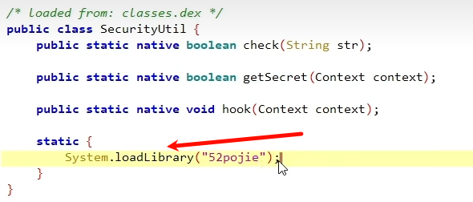
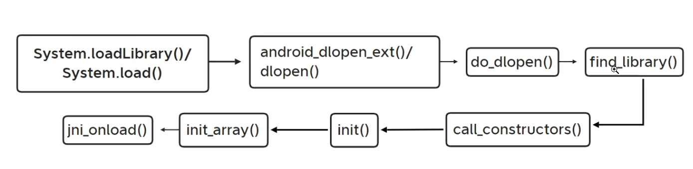

so使用ida动态调试
## 1.so加载流程
---
作用：反调试、脱壳、注入等

流程图：



函数的基本介绍：

| 函数名       | 描述                                                                                                                                                                                                                                                                                                                |
| ------------ | ------------------------------------------------------------------------------------------------------------------------------------------------------------------------------------------------------------------------------------------------------------------------------------------------------------------- |
| `android_dlopen_ext()` 、`dlopen()`、`do_dlopen()` | 这三个函数主要用于加载库文件。`android_dlopen_ext` 是系统的一个函数，用于在运行时动态加载共享库。与标准的 `dlopen()` 函数相比，`android_dlopen_ext` 提供了更多的参数选项和扩展功能，例如支持命名空间、符号版本等特性。|
| `find_library()` | `find_library()` 函数用于查找库，基本的用途是给定一个库的名字，然后查找并返回这个库的路径。|
| `call_constructors()` | `call_constructors()` 是用于调用动态加载库中的构造函数的函数。|
| `init`       | 库的构造函数，用于初始化库中的静态变量或执行其他需要在库被加载时完成的任务。如果没有定义`init`函数，系统将不会执行任何动作。需要注意的是，`init`函数不应该有任何参数，并且也没有返回值。                                                                           |
| `init_array` | `init_array`是ELF（Executable and Linkable Format，可执行和可链接格式）二进制格式中的一个特殊段（section），这个段包含了一些函数的指针，这些函数将在`main()`函数执行前被调用，用于初始化静态局部变量和全局变量。                                                                                         |
| `jni_onload` | 这是Android JNI(Java Native Interface)中的一个函数。当一个native库被系统加载时，该函数会被自动调用。`JNI_OnLoad`可以做一些初始化工作，例如注册你的native方法或者初始化一些数据结构。如果你的native库没有定义这个函数，那么JNI会使用默认的行为。`JNI_OnLoad`的返回值应该是需要的JNI版本，一般返回`JNI_VERSION_1_6`。 |
下断点时机：
应用级别的：java_com_XXX；
外壳级别的：JNI_Onload，.init，.init_array(反调试);
系统级别的：fopen，fget，dvmdexfileopen(脱壳)；

安卓在线源码查看
[AOSPXRef](http://aospxref.com/)

## 2.IDA动态调试
### 1.前置操作：
1.在IDA目录下的dbgsrv，选择跟手机架构一致的server
一般来说android_server64文件

2.adb push android_server64 /data/local/tmp/

3.进入手机端命令：adb shell

4.切换获取手机的root权限：su

5.跳到对应路径：cd /data/local/tmp/

6.提权：chmod 777 android_server64

7.XappDebug hook

---
### 2.调试步骤
分为两种模式，一种是以debug模式启动，第二种则以普通模式启动，二者的区别在于使用场景，有时候要动态调试的参数在app一启动的时候就产生了，时机较早，所以需要以debug模式去挂起app
```
adb shell am start -D -n com.zj.wuaipojie/.ui.ChallengeEight （去掉-D 则表示不以debug模式启动app）
adb forward tcp:23946 tcp:23946 (端口转发)
adb forward tcp:8700 jdwp:PID (pid监听)
jdb -connect com.sun.jdi.SocketAttach:hostname=127.0.0.1,port=8700 (jdb挂起)
```
PS：若不是以debug启动则不需要输入后两条命令
其他的步骤具体看视频

佚名大佬：[[超级详细]实战分析一个Crackme的过程](https://www.52pojie.cn/thread-1315444-1-7.html)

### 3.常见寄存器知识
在进行动态调试，以下是一些常用的寄存器介绍：

| 寄存器名称 | 功能介绍 |
| --- | --- |
| `R0-R12` | 通用寄存器，用于存储临时数据。在函数调用时，`R0-R3`用于存储前四个参数，其余的参数通过堆栈传递。返回值也通过`R0`和`R1`传递。 |
| `R13 (SP)` | 堆栈指针寄存器，指向当前堆栈的顶部。 |
| `R14 (LR)` | 链接寄存器，存储子程序的返回地址。 |
| `R15 (PC)` | 程序计数器，指向下一条要执行的指令。 |
| `CPSR` | 当前程序状态寄存器，保存程序的状态信息，如算术运算的结果标志、中断禁止标志等。 |
| `FPSCR` | 浮点状态和控制寄存器，如果你在调试的代码中涉及到浮点运算，那么这个寄存器会比较重要。 |
### 4.常用快捷键

| 快捷键        | 功能                                                                                                                                                                                                                                                                 |
| ------------- | -------------------------------------------------------------------------------------------------------------------------------------------------------------------------------------------------------------------------------------------------------------------- |
| `F2`          | 在所在行下断点                                                                                                                                                                                                                                                       |
| `F5`          | 可以将ARM指令转化为可读的C代码，同时可以使用Y键，对JNIEnv指针做一个类型转换，从而对JNI里经常使用的JNIEnv方法能够识别                                                                                                                                                 |
| `F7`          | 单步进入调试                                                                                                                                                                                                                                                         |
| `F8`          | 按照顺序一行一行，单步调试                                                                                                                                                                                                                                           |
| `F9`          | 直接跳到下一个断点处                                                                                                                                                                                                                                                 |
| `Shift + F12` | 快速查看so文件中的字符串信息，分析过程中通过一些关键字符串能够迅速定位到关键函数                                                                                                                                                                                     |
| `Ctrl + s`    | 有两个用途，在IDA View页面中可以查看文件so文件的所有段信息，在调试页面可以查看程序中所有so文件映射到内存的基地址。tips:在进行so调试过程中，很有用的一个小技巧就是IDA双开，一个用于进行静态分析；一个用于动态调试。比如说调试过程中要找到一个函数的加载到内存中的位置 |
| `Esc`         | 回退键，能够倒回上一部操作的视图（只有在反汇编窗口才是这个作用，如果是在其他窗口按下esc，会关闭该窗口）                                                                                                                                                              |
| `g`           | 直接跳到某个地址                                                                                                                                                                                                                                                     |
| `y`           | 更改变量的类型                                                                                                                                                                                                                                                       |
| `x`           | 对着某个函数、变量按该快捷键，可以查看它的交叉引用                                                                                                                                                                                                                   |
| `n`           | 更改变量的名称                                                                                                                                                                                                                                                       |
| `p`           | 创建函数                                                                                                                                                                                                                                                             |
### 5.可能遇到的问题

```
1.'jdb' 不是内部或外部命令，也不是可运行的程序或批处理文件。
```
<http://t.csdn.cn/paKAt>
```
2.java.io.IOException: handshake failed - connection prematurally closed
        at com.sun.tools.jdi.SocketTransportService.handshake(SocketTransportService.java:136)
        at com.sun.tools.jdi.SocketTransportService.attach(SocketTransportService.java:232)
        at com.sun.tools.jdi.GenericAttachingConnector.attach(GenericAttachingConnector.java:116)
        at com.sun.tools.jdi.SocketAttachingConnector.attach(SocketAttachingConnector.java:90)
        at com.sun.tools.example.debug.tty.VMConnection.attachTarget(VMConnection.java:519)
        at com.sun.tools.example.debug.tty.VMConnection.open(VMConnection.java:328)
        at com.sun.tools.example.debug.tty.Env.init(Env.java:63)
        at com.sun.tools.example.debug.tty.TTY.main(TTY.java:1066)
致命错误:
无法附加到目标 VM。
解决方法：有可能是手机问题，建议低版本真机，不要用模拟器！切命令顺序不要乱！另外也有可能软件有反调试！
```
```
3.动态调试中找不到so文件
解决方法：可以尝试手动复制一份对应的so文件放到data/app/包名/lib目录下
```
```
4.device offline
解决方法：重新插拔usb，再不行就重启机子
```
```
5.0.0.0.0:23946: bind: Address already in use
解决方案：
adb shell "su -c 'lsof | grep 23946'" //获取pid
adb shell "su -c 'kill -9 PID'" //这里的pid要根据上一步获取的填写
```
### 6.常见反调试
1.调试端口检测
检测常见的23946端口，所以在运行时可以加 -p 指定一个另外的端口来过掉这个检测
2.调试进程名检测
固定的进程名 android_server gdb_server等等，所以要改个名字，例如as64
3.ptrace检测
每个进程同时刻只能被1个调试进程ptrace ，主动ptrace本进程可以使得其他调试器无法调试
实现代码：
```c++
int ptrace_protect()//ptrace附加自身线程 会导致此进程TracerPid 变为父进程的TracerPid 即zygote
{
    return ptrace(PTRACE_TRACEME,0,0,0);;//返回-1即为已经被调试
}
```

## 3.SO防护手段

常见防护手段:

| 主要功能         | 描述                                                                                                                       |
| ---------------- | -------------------------------------------------------------------------------------------------------------------------- |
| SO加壳           | 对C/C++源码编译出来的SO文件进行加壳，使SO文件无法正确反编译和反汇编。                                                      |
| SO源码虚拟化保护 | 将原始汇编指令翻译为自定义的虚拟机指令，跳转到自定义的虚拟机中执行，每次保护生成的虚拟机指令随机，且对虚拟机解释器再度混淆 |
| SO防调用         | 对SO文件进行授权绑定，防止SO文件被非授权应用调用运行。                                                                     |
| SO Linker        | 对整个SO文件进行加密压缩，包括代码段、符号表和字符串等，运行时再解密解压缩到内存，从而有效的防止SO数据的泄露。             |
| SO源码混淆       | 常量字符串加密、分裂基本块、等价指令替换、虚假控制流、控制流平坦化。                                         |
| SO环境监测                |   防frida\xposed\root、防动态调试、防模拟器、防多开等                                                                                                                        |

### 1.ollvm简介
LLVM(Obfuscator-LLVM)是瑞士西北应用科技大学安全实验室于2010年6月份发起的一个项目,该项目旨在提供一套开源的针对LLVM的代码混淆工具,以增加对逆向工程的难度，只不过仅更新到llvm的4.0，2017年开始就没在更新。
[项目地址](https://github.com/obfuscator-llvm/obfuscator)
```
源代码（c/c++）经过clang--> 中间代码(经过一系列的优化，优化用的是Pass)--> 机器码
```