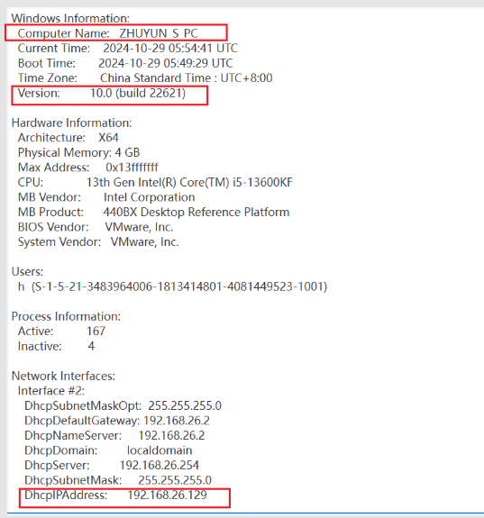
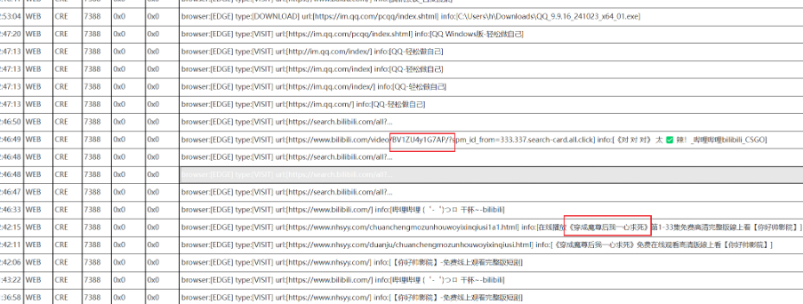
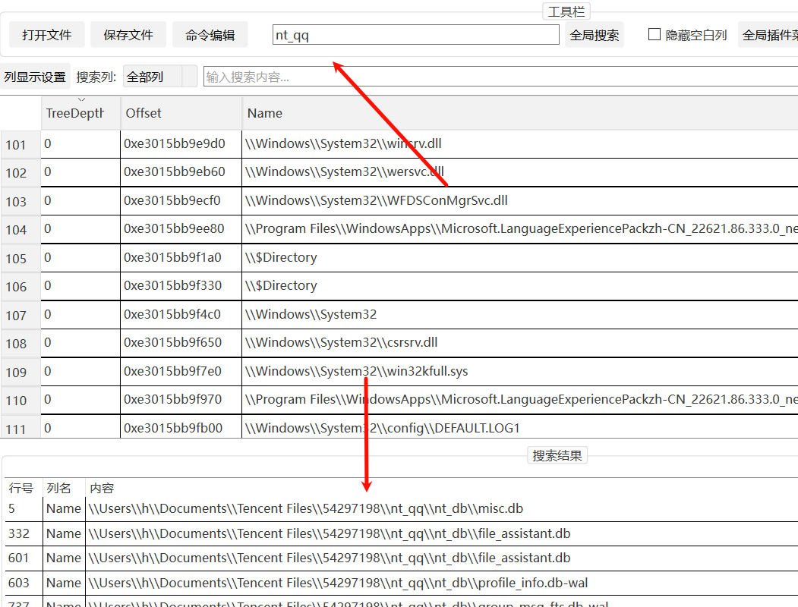
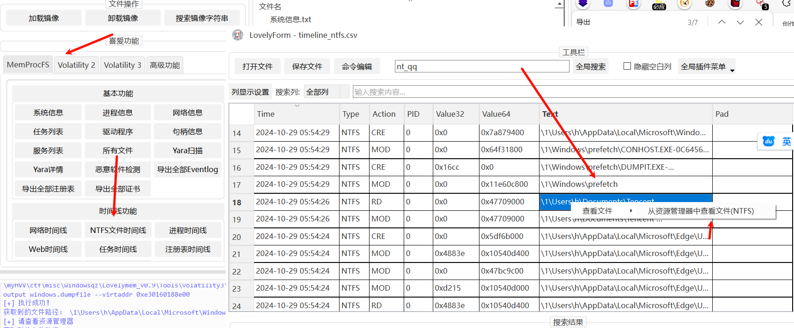
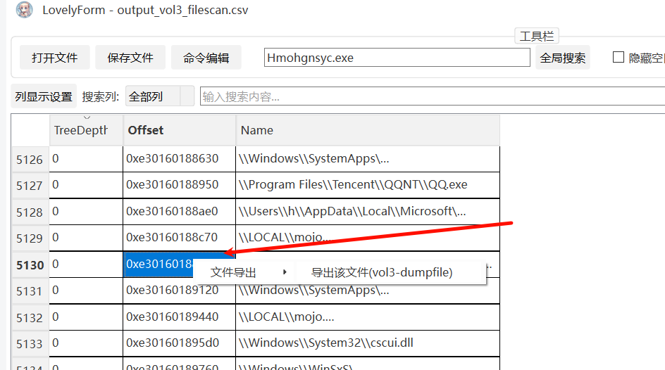
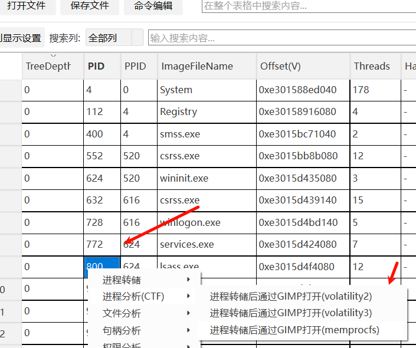

内存取证：对计算机智能设备运行时的物理内存中存储的临时数据进行获取和分析，提取flag。
解析window/linux的内存结构，分析进程等内存数据，根据题目，提取分析指定进程的特定内存数据。

提取window内存中密码hash或直接使用mimikatz，提取笔记本内容，桌面文件等。
yara规则分析内存马。

^
## **内存镜像文件**
1. **.vmem文件**：这是一种由虚拟机软件（如VMware）生成的虚拟机内存快照文件。虚拟机内存快照文件记录了虚拟机在某个时间点的内存状态。取证人员可以通过导出虚拟机内存快照来获取虚拟机的内存数据，进而进行分析和取证工作。
2. **.raw文件**：这是一种原始内存镜像文件格式，通常由专用的内存取证工具（如dd或F-Response）生成。原始内存镜像文件是对系统内存的一对一拷贝，它包含了内存中的所有数据，包括正在运行的程序、操作系统状态等。取证人员可以使用这种文件来进行后续的取证分析。

3.  .img/.dmp文件
^
## **内存分析框架：Volatiliity**
<https://www.cnblogs.com/qq3285862072/p/11869403.html>
<https://lyes.host/post/ctf%E4%B8%ADvolatility%E5%B8%B8%E7%94%A8%E5%91%BD%E4%BB%A4/>
<https://wiki.wgpsec.org/knowledge/ctf/Volatility.html>

基本命令:
```
python2 vol.py -f [内存文件] --profile=[配置文件] <插件>

volatility -f [内存文件] --profile=[配置文件] <插件>

volatility -f /opt/test.vmem -profile = Win7SP1x86_23418 pslist
```
列题，提取笔记本内容
```
查看镜像信息，以及Profile
volatility -f mem.raw imageinfo

Profile可能有多个，选择一个合适的一般第一个如：Win7SP1x86_23418

查看Win7SP1x86_23418的进程
volatility -f mem.raw --profile=Win7SP1x86_23418 pslist

将记事本notepad.exe进程号3552，dump出为3552.dmp文件（非必要）
volatility -f mem.raw --profile=Win7SP1x86_23418 memdump -p 3552 --dump-dir=./

使用editbox插件一键查看记事本当前的内容
volatility -f mem.raw --profile=Win7SP1x86_23418 editbox
```
ctf列题：<https://www.cnblogs.com/mumuhhh/p/17796451.html>
综合案例：<https://zhuanlan.zhihu.com/p/608796920>
图形化自动分析版：<https://github.com/Tokeii0/VolatilityPro>

```
ie浏览器流量历史
python2 vol.py -f raw.raw --profile=Win7SP1x64 iehistory 

文件扫描
python2 vol.py -f raw.raw --profile=Win7SP1x64 filescan | grep "password.txt" 
密码文件
python2 vol.py -f raw.raw --profile=Win7SP1x64 filescan | findstr "password.txt"
联系方式文件
python2 vol.py -f raw.raw --profile=Win7SP1x64 filescan | findstr "Contacts"
.contact文件导出用16进制转字符查看。

dump导出文件，其中-Q值为扫描到的文件的前面显示的值
python2 vol.py -f raw.raw --profile=Win7SP1x64 dumpfiles -Q 0x000000003e296f20 -D ./

查看剪切板内容 （可能有权限维持后门）
python2 vol.py -f raw.raw --profile=Win7SP1x64 clipboard
```

^
## **lovelymem使用**
> 请问这台电脑的该内存镜像被采集时计算机名，该内存镜像ip地址，该内存镜像系统build版 本号(5位)
flag格式为
ctfshow{该内存镜像被采集时计算机名(区分大小写)_该内存镜像ip地址_该内存镜像系统build版本号(5位)}
> 例如:ctfshow{JiaJiaPC_192.168.31.155_10586}



^


> 请问该电脑获取内存镜像是登录的QQ号码，看过的10字短剧名称,看过的bilibili视频BV号

flag格式为

ctfshow{QQ号\_短剧片名\_BV号(区分大小写)}

> 例如:ctfshow{123456789\_穿越后我把妈妈宠上天\_BV1GJ411x7h7}

查看时间线-web文件，即是浏览器记录。

由于QQ的数据会默认保存在用户目录下的Documents\TencentFiles\目录中，在该目录，会生成一个以QQ号命名的目录，所以用volatility3的windows.filescan插件扫描该目录下的文件即可。

文件对象扫描，然后全局搜索TencentFiles或nt_qq即可找到QQ号路径。


右键Text可以在资源管理器中打开目录



v3
filescan后右键offset导出恶意文件，导到了output目录0xe30160188e00


^
进程转储后通过GIMP打开查看图片内容：设置高度1000，调整位移
